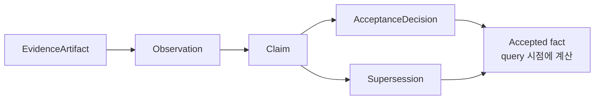
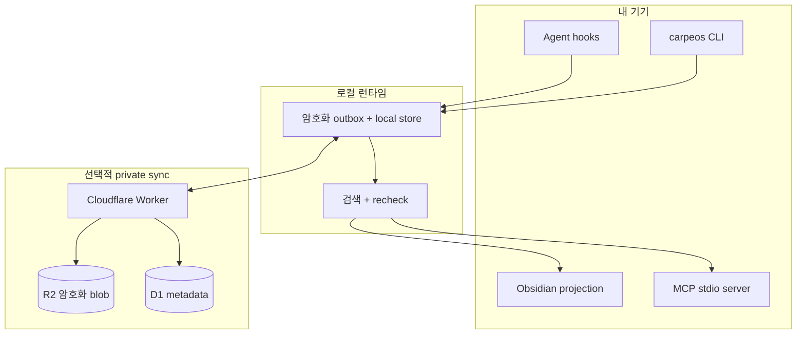
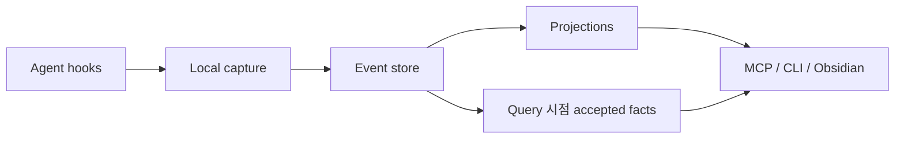

# &nbsp; CarpeOS

[English](README.md) · [한국어](README.ko.md)

[](LICENSE)
[](package.json)
[](#지금-구현된-것)

**Capture context. Compound knowledge.**

CarpeOS는 AI 에이전트와 같이 일하는 사람을 위한 개인 지식 시스템입니다.

에이전트 세션에서 일어난 일을 기록하고, 출처를 남긴 뒤, 나중에 사람이나 다른
에이전트가 다시 찾아볼 수 있게 합니다. 채팅 창 하나에 전부 때려 넣는 방식은
아닙니다.

<p align="center">
  
</p>

<p align="center">
  
</p>

---

## 왜 만들었나

에이전트랑 한참 작업하다 보면, 결정이 하나 남거나, 다시 밟기 싫은 실패
경로가 남거나, 다음에도 쓸 메모가 생깁니다. 그런데 그게 채팅 기록, 터미널
스크롤, 노트 파일에 제각각 흩어져 있고, 며칠 뒤 새 세션을 열면 그 맥락은
거의 안 넘어갑니다.

CarpeOS는 그 맥락을 내가 통제하는 한곳에 모아 두되, “우리가 X로 정했다”와
“모델이 X를 한 번 말했다”를 같은 취급하지 않게 구조를 둔 시도입니다.

| 자주 겪는 일 | 이쪽 접근 |
| --- | --- |
| 채팅 기록이 날아가거나 믿기 어렵다 | 출처가 남는 append-only 이벤트 |
| “메모리”가 사실상 임베딩 뭉치 | claim / 수락 / supersession을 다른 레코드로 둠 |
| 도구마다 기억이 따로 논다 | 공통 capture + MCP 검색 (특정 벤더 종속 아님) |
| 생성된 노트가 곧 원본이 된다 | 노트·인덱스는 다시 만들 수 있는 projection |
| 기기 두 대면 연속성이 지저분하다 | 로컬 우선, 필요하면 private sync |

> **코드는 공개. 지식은 비공개.**  
> 이 저장소에는 설계, 스펙, 구현이 있습니다. 실제 세션·프로젝트·자격 증명은
> 넣지 않습니다.

---

## 이런 사람에게 맞음

- Codex, Claude Code, Grok Build처럼 에이전트를 여러 개 쓰는데, 도구마다
  기억을 따로 관리하기 싫을 때
- 지난주 결정이 옛 채팅 속에만 있지 않고, 다시 꺼내 쓸 수 있어야 할 때
- 검색 결과에 draft / 거절 / 수락이 구분돼 보여야 할 때
- 데이터는 기본이 로컬이고, sync는 직접 돌리고 싶을 때
- 스키마·테스트가 있는 쪽이, 잘 모르는 “메모리 제품”보다 나을 때

아직 소비자용으로 다듬인 앱이 아닙니다. 호스티드 SaaS도 아니고, 에디터
대체재도 아닙니다. 에이전트 워크플로를 이미 쓰는 사람용 기반 코드에 가깝습니다.

---

## 구성

### 쓰던 에이전트에서 캡처

Codex, Claude Code, Grok Build의 일부 lifecycle 이벤트를 공통 capture 형태로
넘기는 hook 템플릿이 있습니다. raw payload는 암호화 저장소에 두고, 이벤트
로그에는 메타데이터와 참조만 둘 수 있습니다.

### 상태를 뭉개지 않는 모델

Evidence는 claim이 아닙니다. claim이 있다고 해서 바로 “맞다”가 아닙니다.
수락과 supersession은 별도 기록입니다. 그래서 검색할 때 확정된 것, 제안만
된 것, 나중에 바뀐 것을 한 덩어리 텍스트로 뭉개지 않고 구분할 수 있습니다.



### 사람용 / 에이전트용 인터페이스

- **CLI** — rebuild, embed(개발용), `memory search` / `memory get` /
  `memory context-pack`
- **MCP (stdio)** — 로컬 도구 8개 (`memory_context_pack`, `memory_trace`,
  `memory_capture`, `memory_propose_claim` 등)
- **Obsidian projection** — 로컬 스토어에서 Markdown 생성 (원본 아님, projection)

### 로컬 우선, sync는 선택

기기는 로컬 outbox에 씁니다. 여러 기기가 필요하면 Cloudflare Worker/D1/R2용
코드를 직접 띄울 수 있습니다. projection은 이벤트 로그에서 언제든 다시 만들 수
있습니다.



---

## 전체 흐름



알아 둘 규칙:

1. 수락 이후 이벤트 로그는 append-only입니다.
2. “accepted”는 query 시점에 계산합니다. claim 레코드를 덮어쓰지 않습니다.
3. 민감한 plaintext는 이벤트 body 밖에 둡니다.
4. Trust zone은 진짜 격리 경계입니다. 장식용 태그가 아닙니다.
5. 노트·벡터·context pack은 지우고 다시 만들어도 됩니다. canonical store가
   아닙니다.

더 자세한 내용:
[Architecture overview](docs/architecture/overview.md),
[Memory capacity](docs/architecture/memory-capacity.md),
[ADR 0009](docs/adr/0009-memory-capacity-model.md),
[ADRs](docs/adr/),
[spec/v1](spec/v1/).

### 메모리 용량 (전체 vs 활성)

CarpeOS는 **얼마나 쌓아 두는지**와 **지금 에이전트가 얼마나 불러오는지**를
나눕니다.

| 축 | 의미 | 위치 |
| --- | --- | --- |
| **Total capacity** | trust zone 아래 visible 이벤트 + protected blob | L1 store |
| **Active capacity** | budget·재검사 후 pack/search에 실리는 양 | L2 working memory |
| **Procedural memory** | thinking/tool 트레이스 (자동 수락 없음) | L3 |
| **Product projections** | 다시 만들 수 있는 노트·pack·open loop·dashboard | L4 |

Context pack은 기본 16개 **expert-slot**으로 sparse 하게 채우고, accepted fact를
draft보다 앞에 두는 cache-friendly 순서를 씁니다.
[메모리 용량 아키텍처](docs/architecture/memory-capacity.md),
[capacity 마스터 플랜](docs/plans/k3-memory-capacity-master-plan.md)을 보세요.
그래프 기반 회상은 아직 계획 단계입니다:
[GraphRAG 로드맵](docs/plans/graphrag-roadmap.md).

---

## 설치

**Node.js ≥ 22.22** 필요.

### 사용자

```sh
# npm (권장)
npm install -g @innocarpe/carpeos
carpeos setup plan              # 경로·액션만 확인 (변경 없음)
carpeos setup run --apply       # 기본값으로 적용

# 또는 curl (동일 패키지 설치 후 setup run --apply)
curl -fsSL https://raw.githubusercontent.com/innocarpe/carpeos/main/scripts/install.sh | bash
```

`carpeos setup` 은 플래그 나열이 아니라 **명령 + 옵션** 인터페이스입니다.
기본 런타임은 `~/.carpeos`, wrapper는 `~/.local/bin` 이며, PATH에 있으면
**Claude Code / Codex CLI / Grok Build** 에 로컬 MCP를 등록합니다.

```sh
carpeos setup --help            # 전체 파라미터
carpeos setup plan              # 해석된 plan만
carpeos setup run --apply       # 적용
carpeos setup doctor            # 설치 검증
carpeos setup show              # config.json 출력
```

주요 옵션: `--home`, `--bin-dir`, `--workspace-root`, `--trust-zone`,
`--register-mcp auto|none|claude,codex,grok`. `--apply` 없이는 기계를 바꾸지 않습니다.

재현이 중요하면 버전 고정: `npm i -g @innocarpe/carpeos@0.1.0`.
변경 기록: [CHANGELOG.md](CHANGELOG.md).

### 개발자 (git checkout)

```sh
git clone https://github.com/innocarpe/carpeos.git && cd carpeos
node scripts/install-local.mjs plan
node scripts/install-local.mjs run --apply   # 빌드, wrapper, MCP 등록
export PATH="$HOME/.local/bin:$PATH"
node scripts/install-local.mjs doctor
```

글로벌 설치 없이 monorepo만 쓸 때: `pnpm install && pnpm build` 후
`node apps/carpeos-cli/dist/index.js …`
([local capture](docs/guides/local-capture.md)).

### 설치 후 스모크

```sh
carpeos init --home "$HOME/.carpeos" --trust-zone tz_local_default
carpeos memory context-pack \
  --task "Smoke: list what I know" \
  --trust-zone tz_local_default \
  --visible-trust-zone tz_local_default
```

세션 **자동 capture** 는 MCP와 별개로 [`adapters/`](adapters/) hook 이 필요합니다.
자세한 문서:
[one-stop install](docs/guides/one-stop-install.md) ·
[MCP](docs/guides/mcp-server.md) ·
[context-pack smoke](docs/guides/mcp-context-pack-smoke.md).

### 에이전트가 이 저장소를 설치할 때

설치는 **idempotent** 하게, private 데이터는 **git 밖**에 둡니다.

1. 우선 `npm i -g @innocarpe/carpeos` + `carpeos setup plan` 후
   `carpeos setup run --apply` (또는 `install.sh`).
2. 소스 작업이면 checkout에서 `node scripts/install-local.mjs run --apply`.
3. `~/.carpeos`, credential, 실제 세션 데이터를 커밋하지 말 것.
4. 설치 경로를 새로 만들지 말 것. setup이 Claude/Codex/Grok MCP를 등록함.
5. 릴리스는 SemVer + `vX.Y.Z` 태그만 —
   [versioning](docs/maintainers/versioning-and-releases.md),
   스킬 `skills/carpeos-release/SKILL.md`
   (`./scripts/install-release-skill.sh`).

| 가이드 | 링크 |
| --- | --- |
| 설치 (전체 경로) | [docs/guides/one-stop-install.md](docs/guides/one-stop-install.md) |
| Capture & hooks | [docs/guides/local-capture.md](docs/guides/local-capture.md) |
| Retrieval / context-pack CLI | [docs/guides/retrieval.md](docs/guides/retrieval.md) |
| MCP | [docs/guides/mcp-server.md](docs/guides/mcp-server.md) |
| 버전·릴리스 | [docs/maintainers/versioning-and-releases.md](docs/maintainers/versioning-and-releases.md) |
| Sync / multi-Mac | [docs/guides/cross-mac-bootstrap-recovery.md](docs/guides/cross-mac-bootstrap-recovery.md) |

---

## 지금 구현된 것

pre-MVP입니다. 로컬 경로(capture → outbox → sync client → retrieval → MCP →
Obsidian projection)는 이 monorepo에 구현돼 있고, synthetic 테스트가 붙어
있습니다.

G008은 release-readiness 문서와 synthetic local end-to-end proof를 추가합니다.
Node 22.22.0에서 `pnpm check`가 통과했고,
`pnpm --filter @carpeos/sync-worker test:e2e`로 opt-in synthetic local
Worker+D1+R2 gate가 통과했습니다. 이 증거는 로컬 증거일 뿐입니다.

| 영역 | 상태 |
| --- | --- |
| Specs, ontology, ADRs | 있음 |
| Local capture + outbox | 구현 (synthetic 테스트) |
| Sync Worker/client | 코드 + 로컬 테스트. production 배포 주장 없음 |
| Local hybrid retrieval | 구현 (개발용 deterministic embedding) |
| MCP stdio server (도구 8개) | 로컬만 |
| Expert-slot context pack | CLI + MCP (로컬) |
| `carpeos setup` / one-stop install | 있음. npm 패키지 `@innocarpe/carpeos` |
| OpenLoop / dashboard 라이브러리 | 라이브러리+테스트. 제품 UI 아님 |
| Obsidian projection package | 로컬만 |
| Synthetic G008 local e2e | 로컬만. opt-in Worker+D1+R2 proof |
| Hosted embeddings | 아직 없음 |
| GraphRAG traversal | 계획 — [로드맵](docs/plans/graphrag-roadmap.md) |
| Hosted multi-tenant SaaS | 이 저장소 목표 아님 |

**NOT DEPLOYED:** hosted Worker, D1/R2 production, private vault, hosted MCP 는
이 저장소가 증명하지 않습니다. npm 게시는 SemVer 태그 + CI 게이트를 따릅니다
([versioning](docs/maintainers/versioning-and-releases.md)).

어댑터 설치, 실제 Cloudflare 운영, hosted MCP, production 검색 품질을 “됐다”고
보지 마세요. 이 저장소에 테스트와 문서가 생기기 전엔 미완입니다.

---

## 저장소 경계

공개되는 건 구현뿐입니다. 런타임 지식은 비공개입니다.

| 여기 OK | 여기 금지 |
| --- | --- |
| Synthetic fixture (`Example Alpha` 등) | 실제 프로젝트명, private URL |
| 프로토콜 예시 | 실제 세션 transcript |
| 테스트·스키마 | credential, token, production log |
| 기여자 문서 | 런타임 DB dump, 개인 경로 |

---

## 디자인 영향

[obsidian-mind](https://github.com/breferrari/obsidian-mind)와 겹치는 문제의식
(에이전트 메모리, hook, 에이전트용 검색)은 있습니다. 구현은 별개입니다.
Markdown vault를 원본으로 두지 않고 append-only 이벤트를 쓰고,
claim/수락/supersession·trust zone·protected value·벤더 중립 MCP를 전제로
잡았습니다.

---

## 기여

[CONTRIBUTING.md](CONTRIBUTING.md), [GOVERNANCE.md](GOVERNANCE.md),
[AGENTS.md](AGENTS.md) 참고.

```sh
pnpm check   # format, lint, build, typecheck, test, public-boundary
```

공개 패키지 릴리스는 하네스 공통 스킬을 따릅니다:

```sh
./scripts/install-release-skill.sh   # Claude / Codex / Grok 스킬 링크
# 이후 release / tag / npm — skills/carpeos-release/SKILL.md
```

---

## 라이선스

[Apache License 2.0](LICENSE)
