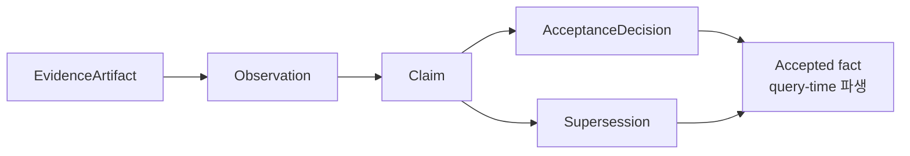
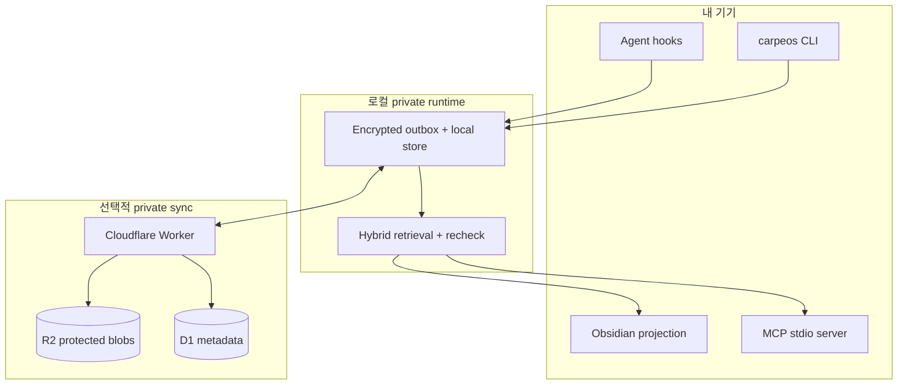
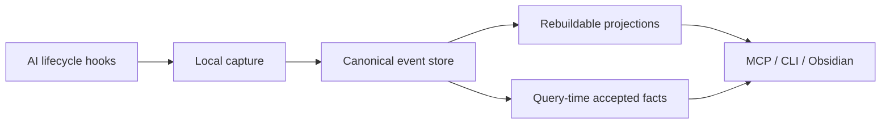

# &nbsp; CarpeOS

[English](README.md) · [한국어](README.ko.md)

[](LICENSE)
[](package.json)
[](#지금-구현된-것)

**Capture context. Compound knowledge.**

CarpeOS는 **AI-assisted work를 위한 개인 지식 운영체제**입니다.

에이전트가 한 일을 캡처하고, provenance를 갖춘 지식으로 구조화한 뒤, **사람과
LLM**이 세션·도구·기기 경계를 넘어 다시 꺼내 쓸 수 있게 만듭니다.

<p align="center">
  
</p>

<p align="center">
  
</p>

---

## 왜 CarpeOS인가

요즘 AI 작업의 잔여물 — 결정, 실패한 경로, 받아들여진 사실, 열린 질문 — 은 채팅
로그·터미널·노트에 흩어지고, 다음 세션의 다음 에이전트는 다시 차갑게 시작합니다.

CarpeOS는 그 잔여물을 **내구성 있는 지식 평면**으로 다룹니다.

| 지금의 고통 | CarpeOS가 지향하는 것 |
| --- | --- |
| 채팅 기록은 휘발적이고 신뢰하기 어렵다 | Provenance가 있는 append-only 이벤트 |
| “메모리”가 임베딩 가방에 가깝다 | Claim / acceptance / supersession을 분리 |
| 에이전트마다 사일로 | Provider-neutral capture + 공유 MCP retrieval |
| 노트·인덱스가 곧 진실이 된다 | Private canonical store 위의 rebuildable projection |
| 기기 간 연속성이 지저분하다 | Local-first capture + private sync |

> **Public implementation. Private knowledge.**  
> 이 저장소는 설계·스펙·코드를 공개합니다. 실제 세션, 프로젝트, 자격 증명은
> 절대 넣지 않습니다.

---

## 이런 때 쓰면 좋습니다

- **여러 AI 에이전트**(Codex, Claude Code, Grok Build 등)를 오가며 채팅 다섯
  개가 아니라 **하나의 메모리 평면**이 필요할 때
- 다음 세션에도 **결정이 살아남아야** 할 때 — “모델이 한 번 말했다” 수준이
  아니라
- **권위(authority)** 가 중요할 때 — draft / rejected / accepted가 retrieval에서
  똑같이 보이면 안 될 때
- **로컬 우선 프라이버시**를 원하면서, 직접 운영하는 private cloud sync 옵션이
  필요할 때
- 스키마·trust zone·erasure·테스트를 1급 시민으로 두는 **계약 중심** 접근을
  선호할 때

아직 **패키지형 최종 사용자 제품**, 호스티드 SaaS 메모리, 에디터 대체재는
아닙니다. 매일 에이전트와 일하면서 지식이 쌓이기를 원하는 사람을 위한
인프라에 가깝습니다.

---

## 무엇을 얻나요

### 이미 쓰는 에이전트에서 캡처

Codex, Claude Code, Grok Build의 선택된 lifecycle 이벤트를 provider-neutral
envelope로 정규화하는 hook 템플릿을 제공합니다. Raw payload는 encrypted
protected-value에 두고, canonical 레이어에는 metadata와 reference만 남길 수
있습니다.

### 권위를 보존하는 지식 모델

Evidence는 claim이 아닙니다. Claim은 accepted fact가 아닙니다. Acceptance와
supersession은 별도의 불변 기록입니다. 그래서 retrieval이 **알려진 것 / 제안된
것 / 뒤집힌 것**을 한 덩어리 텍스트로 뭉개지 않고 드러낼 수 있습니다.



### 사람과 에이전트가 공유하는 retrieval

- **CLI** — projection rebuild, (dev) embed, `memory search` / `memory get`
- **MCP (stdio)** — `memory_context_pack`, `memory_trace`, `memory_capture`,
  `memory_propose_claim` 등 로컬 도구 8개
- **Obsidian projection** — 로컬 스토어 스냅샷에서 manifest-bounded Markdown
  생성 (projection일 뿐, canonical 권위 아님)

### Local-first, privately syncable

기기는 append-only outbox에 씁니다. Cloudflare Worker/D1/R2 경로는 private
operator용 deployable 코드로 존재합니다. Projection은 언제든 canonical
event에서 다시 만들 수 있습니다.



---

## 동작 방식



**사용자에게 중요한 불변 조건:**

1. 수락 이후 canonical event는 append-only입니다.
2. Accepted fact는 **query-time 파생**입니다 — claim을 “accepted”로 mutate하지
   않습니다.
3. Protected plaintext는 canonical event body 밖에 둡니다.
4. Trust zone은 장식이 아니라 물리적 격리 경계입니다.
5. 노트·벡터·context pack은 projection입니다 — rebuild 가능하고 그 자체로
   권위가 아닙니다.

더 깊은 설계는
[Architecture overview](docs/architecture/overview.md),
[ADRs](docs/adr/),
[spec/v1](spec/v1/)을 보세요.

---

## Quick start

**사전 요구:** Node.js ≥ 22.22, pnpm ≥ 11.16.

```sh
pnpm install
pnpm build

# 로컬 런타임 초기화
node apps/carpeos-cli/dist/index.js init
node apps/carpeos-cli/dist/index.js project identify

# synthetic hook payload 하나 캡처
node apps/carpeos-cli/dist/index.js capture-hook --provider codex --input argv \
  '{"hook_event_name":"SessionEnd","session_id":"session_synthetic","timestamp":"2026-01-01T00:00:00Z","message":"synthetic capture"}'

node apps/carpeos-cli/dist/index.js outbox status
```

가이드:

| 경로 | 문서 |
| --- | --- |
| Local capture & hooks | [docs/guides/local-capture.md](docs/guides/local-capture.md) |
| Private Cloudflare sync | [docs/guides/cloudflare-sync.md](docs/guides/cloudflare-sync.md) |
| Retrieval & memory CLI | [docs/guides/retrieval.md](docs/guides/retrieval.md) |
| MCP server 설정 | [docs/guides/mcp-server.md](docs/guides/mcp-server.md) |
| Obsidian projection | [docs/guides/obsidian-projection.md](docs/guides/obsidian-projection.md) |

Codex / Claude Code / Grok Build 어댑터 템플릿은 [`adapters/`](adapters/)에
있습니다.

---

## 지금 구현된 것

CarpeOS는 **pre-MVP**입니다. Capture → outbox → sync client → retrieval → MCP →
Obsidian projection 로컬 경로는 이 monorepo에서 **synthetic test coverage**와
함께 구현되어 있습니다.

| 영역 | 상태 |
| --- | --- |
| Specs, ontology, ADRs | 존재 |
| Local capture + durable outbox | 구현 (synthetic 테스트) |
| Sync Worker/client (Cloudflare 경로) | Deployable 코드 + 로컬 테스트 — live deploy 주장 없음 |
| Hybrid local retrieval | Deterministic dev embedding으로 구현 |
| MCP stdio server (도구 8개) | 로컬 구현 |
| Obsidian projection package | 로컬 구현 |
| Hosted embeddings / GraphRAG / dashboard | 계획, active feature 아님 |
| 패키지형 최종 사용자 배포 | 준비되지 않음 |

어댑터 설치, production Cloudflare provisioning, hosted MCP, production
semantic quality를 “완료”로 취급하지 마세요. 여기서 테스트·문서화되기 전까지는
아직입니다.

---

## 저장소 경계

이 저장소는 public implementation입니다. Runtime knowledge는 private입니다.

| 이 저장소에 OK | 절대 금지 |
| --- | --- |
| Synthetic fixture (`Example Alpha` 등) | 실제 프로젝트명·private URL |
| Protocol example | 실제 session transcript |
| 테스트·스키마 | Credential, token, production log |
| Contributor docs | Runtime DB export / 로컬 사용자 경로 |

---

## 디자인 영향

[obsidian-mind](https://github.com/breferrari/obsidian-mind)의 durable agent
memory, lifecycle hook, agent-facing semantic retrieval 비전에서 일부 영감을
받았습니다.

CarpeOS는 독립 설계입니다: Markdown vault가 권위가 아니라 append-only
canonical event, 명시적 claim/acceptance/supersession, trust zone, protected
value, provider-neutral MCP 접근.

---

## 기여

[CONTRIBUTING.md](CONTRIBUTING.md), [GOVERNANCE.md](GOVERNANCE.md),
[AGENTS.md](AGENTS.md)를 참고하세요.

```sh
pnpm check   # format, lint, build, typecheck, test, public-boundary
```

PR 레이블은 가볍게: kind 하나
(`feat` / `fix` / `docs` / `spec` / `chore`) + 선택적 area.
자세한 내용: [docs/maintainers/github-labels.md](docs/maintainers/github-labels.md).

---

## 라이선스

[Apache License 2.0](LICENSE)
