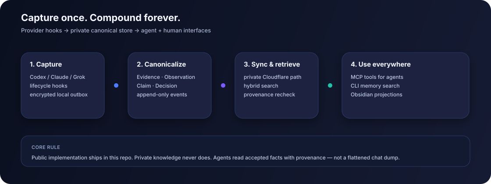
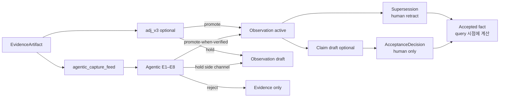
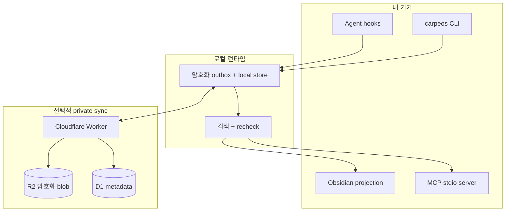
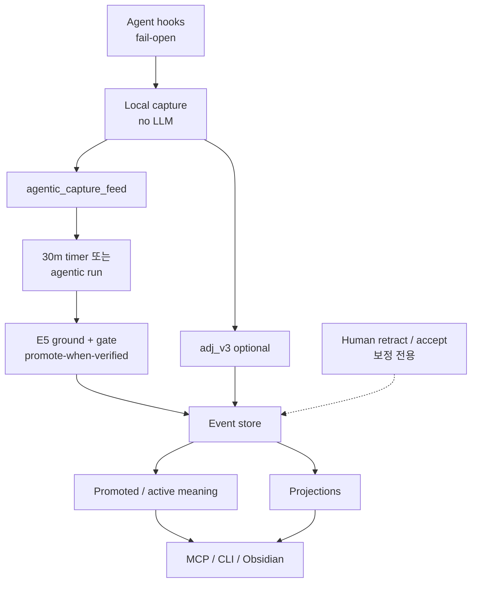

# &nbsp; CarpeOS

[English](README.md) · [한국어](README.ko.md)

[](https://www.npmjs.com/package/@innocarpe/carpeos)
[](https://github.com/innocarpe/CarpeOS/actions/workflows/ci.yml)
[](LICENSE)
[](package.json)
[](https://github.com/innocarpe/CarpeOS/releases/latest)
[](https://innocarpe.github.io/carpeos-website/)

**Capture context. Compound knowledge.**

CarpeOS는 AI 보조 작업을 위한 개인 지식 OS입니다. 에이전트 세션을 출처와 함께
캡처하고, 쓰기 시점에 **내구성 있는 의미**를 형성하며 (저비용 `adj_v3` + 캡처 후
**Agentic Layer**), 승격된 결정을 기본 검색에 두고, MCP·CLI·Obsidian으로 사람과
에이전트가 나중에 다시 꺼내 쓰게 합니다. 전부 로컬 우선이며, **happy path에
사람 리뷰가 필수이지 않습니다**.

세션 덤프 전부를 “메모리”로 취급하지 않습니다. 각 조각이 어디서 왔는지 흔적을
남기되, **승격된 의미 단위**가 기본 검색 대상입니다.

**최신 패키지:** [`@innocarpe/carpeos@6.6.2`](https://www.npmjs.com/package/@innocarpe/carpeos)
([변경 기록](CHANGELOG.md) · [`v6.6.2`](https://github.com/innocarpe/CarpeOS/releases/tag/v6.6.2)).

<p align="center">
  
</p>

<p align="center">
  
</p>

## 웹사이트

**[CarpeOS 웹사이트](https://innocarpe.github.io/carpeos-website/)**에서 제품
개요, 시스템 모델, 설치 경로, 공개 문서 안내를 확인할 수 있습니다.

---

## 왜 만들었나

에이전트랑 한참 작업하다 보면, 결정이 하나 남거나, 다시 밟기 싫은 실패
경로가 남거나, 다음에도 쓸 메모가 생깁니다. 그런데 그게 채팅 기록, 터미널
스크롤, 노트 파일에 제각각 흩어져 있고, 며칠 뒤 새 세션을 열면 그 맥락은
거의 안 넘어갑니다.

CarpeOS는 그 맥락을 내가 통제하는 한곳에 모아 두되, “우리가 X로 정했다”와
“모델이 X를 한 번 말했다”를 같은 취급하지 않게 구조를 둔 시도입니다.

| 자주 겪는 일 | 이쪽 접근 |
| --- | --- |
| 채팅 기록이 날아가거나 믿기 어렵다 | 출처가 남는 append-only 이벤트 |
| 세션 노이즈가 “메모리”를 오염시킨다 | 캡처 후 판정 + agentic gate; 기본 검색은 **promote만** |
| 다음 에이전트가 지난 세션 결정을 잊는다 | HITL-free Agentic Layer가 검증된 의미를 기본 검색에 올림 |
| “메모리”가 사실상 임베딩 뭉치 | claim / 수락 / supersession을 다른 레코드로 둠 |
| 도구마다 기억이 따로 논다 | 공통 capture + MCP 검색 (특정 벤더 종속 아님) |
| 생성된 노트가 곧 원본이 된다 | 노트·인덱스는 다시 만들 수 있는 projection |
| 기기 두 대면 연속성이 지저분하다 | 로컬 우선, 필요하면 private sync |

> **코드는 공개. 지식은 비공개.**  
> 이 저장소에는 설계, 스펙, 구현이 있습니다. 실제 세션·프로젝트·자격 증명은
> 넣지 않습니다.

---

## 이런 사람에게 맞음

- Codex, Claude Code, Grok Build처럼 에이전트를 여러 개 쓰는데, 도구마다
  기억을 따로 관리하기 싫을 때
- 지난주 결정이 옛 채팅 속에만 있지 않고, 다시 꺼내 쓸 수 있어야 할 때
- 검색 결과에 draft / 거절 / 수락이 구분돼 보여야 할 때
- 데이터는 기본이 로컬이고, sync는 직접 돌리고 싶을 때
- 스키마·테스트가 있는 쪽이, 잘 모르는 “메모리 제품”보다 나을 때

아직 소비자용으로 다듬인 앱이 아닙니다. 호스티드 SaaS도 아니고, 에디터
대체재도 아닙니다. 에이전트 워크플로를 이미 쓰는 사람용 기반 코드에 가깝습니다.

---

## 구성

### 쓰던 에이전트에서 캡처

Codex, Claude Code, Grok Build의 일부 lifecycle 이벤트를 공통 capture 형태로
넘깁니다. raw payload는 암호화 저장소에, 이벤트 로그에는 메타데이터·참조를
둡니다. 호스트 훅은 **fail-open·빠른 경로**를 유지합니다.

### 기억하기 전에 의미 형성 (두 평면)

캡처 뒤 쓰기 시점 경로가 둘 있습니다.

| 평면 | 역할 | 기본 |
| --- | --- | --- |
| **`adj_v3`** | 저비용 규칙 프리필터 / 노이즈 거부 | 비교 기준선으로 유지 |
| **Agentic Layer** (`agentic_v1`) | 인용·타입 brain (네트워크 시 Flash-only) | **6.6.0부터 Product 6 happy path** |

| Disposition | 의미 단위 | 기본 검색 |
| --- | --- | --- |
| **promote** | active Observation | 포함 |
| **hold** | draft Observation (사이드 채널) | 제외 (`--include-held` / `include_held` 시에만) |
| **reject** | disposition만 (증거는 남을 수 있음) | 제외 |

**Agentic (ADR 0018):** allowlist 종류(`decision` / `constraint` / `preference`)는
E5가 statement를 cited span에 근거했을 때 **기본 promote** — 사람 클릭 불필요.
`procedure`·`fact_candidate`는 hold-biased. 사람은 **retract**·선택적
**accept-claim**·hold 정리 — **보정 전용**.

어느 경로도 `AcceptanceDecision`을 자동 생성하지 않습니다. `adj_v3`와 B0 preview는
그대로 사용할 수 있습니다.

```sh
carpeos adjudicate reconcile-policy \
  --from-policy adj_v1 --to-policy adj_v3 \
  --trust-zone tz_synthetic --limit 100
```

B0는 metadata-only이며 정확히 `--from-policy`, `--to-policy`, `--trust-zone`, `--limit`
flag만 지원합니다. `--apply`, `--apply-safe-subset`, acknowledgement, receipt,
Supersession construction은 지원하지 않습니다. B1 write/apply/receipt는 계속
deferred입니다. dogfood 입력과 출력은 synthetic·disposable입니다.

### 상태를 뭉개지 않는 모델

Evidence는 claim이 아닙니다. claim이 있다고 해서 바로 “맞다”가 아닙니다.
수락과 supersession은 별도 기록입니다. 검색 시 확정·제안·교체를 한 덩어리
벡터 텍스트로 뭉개지 않습니다.



### 사람용 / 에이전트용 인터페이스

- **CLI** — `capture-hook`, `extract`, **`adjudicate`**, **`agentic`** (run /
  timer / retract / golden / graphrag…), `retrieval rebuild`,
  `memory search|get|context-pack` (기본 promoted only; `--include-held` 선택),
  `sync status|push|pull|once|cycle`
- **MCP (stdio)** — 로컬 도구 8개 (`memory_search`, `memory_get`,
  `memory_context_pack`, `memory_trace`, `memory_timeline`, `memory_related`,
  `memory_capture`, `memory_propose_claim`)
- **Always-on agentic** — 선택 30분 타이머: `carpeos agentic timer install`
  (기본 네트워크 off)
- **Obsidian projection** — 로컬 스토어에서 Markdown 생성 (원본 아님, projection)
- **OKF v0.2 export projection** — `carpeos okf export|rebuild`가 신뢰 영역 범위를
  명시한 portable bundle을 만듭니다. 기본값은 promoted/active이며 canonical storage나
  import 경로가 아닙니다 ([가이드](docs/guides/okf-export.md)).

### 로컬 우선, sync는 선택

기기는 로컬 outbox에 씁니다. 여러 기기가 필요하면 Cloudflare Worker/D1/R2용
코드를 직접 띄울 수 있고, 운영용 **bounded** `carpeos sync cycle`이 있습니다.
projection은 이벤트 로그에서 언제든 다시 만들 수 있습니다.



---

## 전체 흐름



알아 둘 규칙:

1. 이벤트 로그와 disposition은 append-only입니다 (policy version별).
2. 기본 검색은 **promoted/active** 의미 단위입니다. 모든 세션이 메모리가 아닙니다.
3. Agentic **promote-when-verified**는 load-bearing HITL 없이 루프를 닫습니다
   (ADR 0018). 형식적 `AcceptanceDecision`은 여전히 사람 전용·선택입니다.
4. “accepted”는 query 시점에 계산합니다. claim 레코드를 덮어쓰지 않습니다.
5. 민감한 plaintext는 이벤트 body 밖에 둡니다.
6. Trust zone은 진짜 격리 경계입니다. 장식용 태그가 아닙니다.
7. 노트·벡터·context pack은 지우고 다시 만들어도 됩니다. canonical store가
   아닙니다.

더 자세한 내용:
[Architecture overview](docs/architecture/overview.md),
[Agentic Layer](docs/architecture/agentic-layer.md),
[Memory capacity](docs/architecture/memory-capacity.md),
[ADR 0017](docs/adr/0017-agentic-layer-write-time-knowledge.md),
[ADR 0018](docs/adr/0018-agentic-hitl-free-compound-loop.md),
[ADRs](docs/adr/),
[spec/v1](spec/v1/).

### 메모리 용량 (전체 vs 활성)

CarpeOS는 **얼마나 쌓아 두는지**와 **지금 에이전트가 얼마나 불러오는지**를
나눕니다.

| 축 | 의미 | 위치 |
| --- | --- | --- |
| **Total capacity** | trust zone 아래 visible 이벤트 + protected blob | L1 store |
| **Active capacity** | budget·재검사 후 pack/search에 실리는 양 | L2 working memory |
| **Procedural memory** | thinking/tool 트레이스 (자동 수락 없음) | L3 |
| **Product projections** | 다시 만들 수 있는 노트·pack·open loop·dashboard | L4 |

Context pack은 기본 16개 **expert-slot**으로 sparse 하게 채우고, accepted fact를
draft보다 앞에 두는 cache-friendly 순서를 씁니다.
[메모리 용량 아키텍처](docs/architecture/memory-capacity.md),
[capacity 마스터 플랜](docs/plans/k3-memory-capacity-master-plan.md)을 보세요.
교차 저장소 partition과 worktree facet을 포함한 retrieval-first 그래프/하이브리드
회상은 3.0에 출시되었습니다. hosted graph adapter와 그 밖의 로드맵 작업은 아직
계획 상태입니다. [product 3.0 DoD](docs/maintainers/product-3.0.0.md) 및
[GraphRAG 로드맵](docs/plans/graphrag-roadmap.md)을 보세요.

---

## 설치

**Node.js ≥ 22.22** 필요.

### 사용자

```sh
# npm (권장)
npm install -g @innocarpe/carpeos
carpeos setup plan              # 경로·액션만 확인 (변경 없음)
carpeos setup run --apply       # 기본값으로 적용

# 또는 curl (동일 패키지 설치 후 setup run --apply)
curl -fsSL https://raw.githubusercontent.com/innocarpe/carpeos/main/scripts/install.sh | bash
```

`carpeos setup` 은 플래그 나열이 아니라 **명령 + 옵션** 인터페이스입니다.
기본 런타임은 `~/.carpeos`, wrapper는 `~/.local/bin` 이며, PATH에 있으면
**Claude Code / Codex CLI / Grok Build** 에 로컬 MCP를 등록합니다.

```sh
carpeos setup --help            # 전체 파라미터
carpeos setup plan              # 해석된 plan만
carpeos setup run --apply       # 적용 (home, wrapper, MCP)
carpeos setup hooks install --apply   # 캡처 훅 (머지 안전; 제품 경로)
carpeos setup doctor            # 설치 + 훅 + 스토어 신호 검증
carpeos setup show              # config.json 출력
```

주요 옵션: `--home`, `--bin-dir`, `--workspace-root`, `--trust-zone`,
`--register-mcp auto|none|claude,codex,grok`, `--register-hooks auto|none|…`.
`--apply` 없이는 기계를 바꾸지 않습니다.

재현이 중요하면 버전 고정: `npm i -g @innocarpe/carpeos@6.6.2`.
변경 기록: [CHANGELOG.md](CHANGELOG.md).
제품 마일스톤: [1.0 DoD](docs/maintainers/product-1.0.0.md) (파이프라인) ·
[2.0 DoD](docs/maintainers/product-2.0.0.md) (판정) ·
[3.0 DoD](docs/maintainers/product-3.0.0.md) (retrieval-first 그래프) ·
[3.1 DoD](docs/maintainers/product-3.1.0.md) (OKF v0.2 export) ·
[3.2 DoD](docs/maintainers/product-3.2.0.md) (B0 reconciliation preview).

### 개발자 (git checkout)

```sh
git clone https://github.com/innocarpe/carpeos.git && cd carpeos
node scripts/install-local.mjs plan
node scripts/install-local.mjs run --apply   # 빌드, wrapper, MCP 등록
node scripts/install-local.mjs hooks install --apply
export PATH="$HOME/.local/bin:$PATH"
node scripts/install-local.mjs doctor
```

글로벌 설치 없이 monorepo만 쓸 때: `pnpm install && pnpm build` 후
`node apps/carpeos-cli/dist/index.js …`
([local capture](docs/guides/local-capture.md)).

### 제품 경로: 설치 → 세션 → compound → 검색

```sh
# 1) 런타임 + MCP
carpeos setup run --apply
# 2) 캡처 훅 (사용자 훅을 지우지 않음)
carpeos setup hooks install --apply
# 3) Always-on Agentic brain (30분; 기본 네트워크 off)
carpeos agentic timer install
# 4) doctor (훅, 스토어, 판정 health, 기본 검색=promoted only)
carpeos setup doctor
# 5) 호스트 세션 후 사람 리뷰 없이 의미가 쌓임:
#    capture → feed → agentic run (timer 또는:)
carpeos agentic run --once --materialize
carpeos retrieval rebuild --trust-zone tz_local_default
carpeos memory search \
  --query "durable decision" \
  --trust-zone tz_local_default \
  --visible-trust-zone tz_local_default

# 보정 전용 (happy path 아님)
# carpeos agentic retract --event-id evt_… --reason "…" --decided-by human --human-confirmed
# carpeos agentic promote-held --event-id evt_…
# carpeos adjudicate list-held --limit 50

# Kill / 스테이징
# CARPEOS_AGENTIC=off …
# CARPEOS_AGENTIC_HOLD_FIRST=1 carpeos agentic run --once --materialize
```

`carpeos setup doctor` 는 훅 설치, 최근 `EvidenceArtifact`, Observation/Claim 개수,
**판정 policy_version + promote/hold/reject 카운트**, **기본 검색이 promoted/active
only** 임을 보고합니다 (빈 스토어는 warning).

자동 게이트:

| 게이트 | 증명 내용 |
| --- | --- |
| `pnpm smoke:product` | 1.0 파이프라인 루프 |
| `pnpm smoke:knowledge` | 2.0 promote vs noise reject |
| `pnpm smoke:dogfood` | multi-hook 공개-safe 노이즈 시나리오 |
| `pnpm smoke:mcp` | MCP 도구 surface |

수동/고급 템플릿: [`adapters/`](adapters/). 문서:
[one-stop install](docs/guides/one-stop-install.md) ·
[MCP](docs/guides/mcp-server.md).

### 에이전트가 이 저장소에서 작업할 때

먼저 **[`AGENTS.md`](AGENTS.md)** 를 읽으세요 (공개/사적 경계, PR 라벨, 릴리스 스킬,
설치 규칙). 설치는 멱등으로 두고 `~/.carpeos`·자격 증명·실세션 데이터를 커밋하지 마세요.
`carpeos setup` / `scripts/install-local.mjs` 를 쓰고 임의 설치 경로를 만들지 마세요.
릴리스는 SemVer + `vX.Y.Z` 만
([versioning](docs/maintainers/versioning-and-releases.md),
[major release surface](docs/maintainers/major-release-surface.md),
`skills/carpeos-release/SKILL.md`).

| 가이드 | 링크 |
| --- | --- |
| 설치 (전체 경로) | [docs/guides/one-stop-install.md](docs/guides/one-stop-install.md) |
| Capture & hooks | [docs/guides/local-capture.md](docs/guides/local-capture.md) |
| Retrieval / context-pack CLI | [docs/guides/retrieval.md](docs/guides/retrieval.md) |
| MCP | [docs/guides/mcp-server.md](docs/guides/mcp-server.md) |
| Cloudflare / sync | [docs/guides/cloudflare-sync.md](docs/guides/cloudflare-sync.md) |
| OKF v0.2 export projection | [docs/guides/okf-export.md](docs/guides/okf-export.md) |
| Smokes | `pnpm smoke:mcp` · `smoke:product` · `smoke:knowledge` · `smoke:dogfood` |
| Changelog | [CHANGELOG.md](CHANGELOG.md) |
| Product 1.0 DoD (파이프라인) | [docs/maintainers/product-1.0.0.md](docs/maintainers/product-1.0.0.md) |
| Product 2.0 DoD (판정) | [docs/maintainers/product-2.0.0.md](docs/maintainers/product-2.0.0.md) |
| Product 3.0 DoD (retrieval-first 그래프) | [docs/maintainers/product-3.0.0.md](docs/maintainers/product-3.0.0.md) |
| Product 3.1 DoD (OKF v0.2 export) | [docs/maintainers/product-3.1.0.md](docs/maintainers/product-3.1.0.md) |
| Product 3.2 DoD (B0 reconciliation preview) | [docs/maintainers/product-3.2.0.md](docs/maintainers/product-3.2.0.md) |
| 버전·릴리스 | [docs/maintainers/versioning-and-releases.md](docs/maintainers/versioning-and-releases.md) |
| Sync / multi-Mac | [docs/guides/cross-mac-bootstrap-recovery.md](docs/guides/cross-mac-bootstrap-recovery.md) |
| Memory capacity plan | [docs/plans/k3-memory-capacity-master-plan.md](docs/plans/k3-memory-capacity-master-plan.md) |

---

## 제품 라인 (majors)

현재 npm 패키지는 **`@innocarpe/carpeos@6.6.2`** (`v6.6.2`)입니다. adjudication + retrieval
운영 루프, Product 4 trust plane, opt-in Product 5 draft lane, **Product 6 HITL-free
Agentic Layer**(promote-when-verified, retract, day spend, **30분 timer** — ADR 0018;
capture는 dumb; human tools는 보정 전용)가 포함됩니다.
전체 major/minor thesis·DoD:

- [docs/PRD.md](docs/PRD.md)
- [docs/architecture/agentic-layer.md](docs/architecture/agentic-layer.md)
- [docs/maintainers/](docs/maintainers/) (`product-N.0.0.md`, 예:
  [6.0.0](docs/maintainers/product-6.0.0.md), [5.0.0](docs/maintainers/product-5.0.0.md))

잔여(초록 발명 금지): live Product 4 release authority 대역 외, B1 apply deferred,
hosted graph/edge 미주장, V5는 capture hot path에 없음, procedure auto-promote는
여전히 hold-biased, live Flash는 네트워크 opt-in.

---

## 지금 구현된 것

**공개 패키지:** [`@innocarpe/carpeos@6.6.2`](https://www.npmjs.com/package/@innocarpe/carpeos)
(`v6.6.2` · [CHANGELOG](CHANGELOG.md)). npm 설치는 호스티드 배포나 live Product 4
release authority를 뜻하지 **않습니다**.

기본 로컬 루프 (CI 게이트):

```text
hooks → 암호화 증거 → agentic_capture_feed (capture에 LLM 없음)
  → agentic run / 30분 timer (promote-when-verified)
  → 기본 검색의 active Observation
  → retrieval-first 그래프/하이브리드 회상 → MCP / CLI
  (+ adj_v3 기준선, 로컬 OKF export, 선택 private sync, Obsidian)

# Kill: CARPEOS_AGENTIC=off
# 스테이징: CARPEOS_AGENTIC_HOLD_FIRST=1
# Live Flash: carpeos agentic run --once --allow-network --materialize
```

| 영역 | 상태 |
| --- | --- |
| Specs, ontology, ADRs | 있음 ([ADR 0012](docs/adr/0012-knowledge-adjudication.md), [0017](docs/adr/0017-agentic-layer-write-time-knowledge.md), [0018](docs/adr/0018-agentic-hitl-free-compound-loop.md)) |
| Local capture + outbox | 출시 |
| Knowledge adjudication (`adj_v3`) | **3.2에 출시** — automatic Claim / `AcceptanceDecision` 없음 |
| 기본 retrieval | **promoted/active only**; held는 opt-in |
| Doctor 판정 health | 출시 |
| Sync Worker/client + bounded `sync cycle` | 코드 + 로컬 테스트. production edge 주장 없음 |
| MCP stdio (도구 8개) | 로컬만 |
| Expert-slot context pack | CLI + MCP (로컬) |
| Retrieval-first 그래프/하이브리드 회상 | **출시** — 6.4 GraphRAG typed boost |
| Hosted graph adapter / service | 계획됨; 출시·배포되지 않음 |
| OKF v0.2 export projection | **3.1에 출시** — 로컬 export만 |
| Product 3.x–5.x | **출시** — `docs/maintainers/` DoD |
| Product 6 Agentic Layer (`carpeos agentic`) | **6.6.0 HITL-free 출시** — promote-when-verified, retract, day spend, 30분 timer; [product-6.0.0](docs/maintainers/product-6.0.0.md), [agentic-layer](docs/architecture/agentic-layer.md) |
| `carpeos setup` / one-stop install | 출시 (`@innocarpe/carpeos`) |
| OpenLoop / dashboard 라이브러리 | 라이브러리+테스트. 제품 UI 아님 |
| Obsidian projection | 로컬만 |
| Hosted embeddings / multi-tenant SaaS | 이 저장소 목표 아님 |

**NOT DEPLOYED:** hosted Worker, D1/R2 production, hosted graph adapter/service,
private vault, hosted MCP 는 이 저장소가 증명하지 않습니다. npm 게시는 SemVer 태그 + CI
([versioning](docs/maintainers/versioning-and-releases.md)).

어댑터 설치, 실제 Cloudflare 운영, hosted MCP, 인간 수준 판정 품질을 “완료”로
보지 마세요.

---

## 저장소 경계

공개되는 건 구현뿐입니다. 런타임 지식은 비공개입니다.

| 여기 OK | 여기 금지 |
| --- | --- |
| Synthetic fixture (`Example Alpha` 등) | 실제 프로젝트명, private URL |
| 프로토콜 예시 | 실제 세션 transcript |
| 테스트·스키마 | credential, token, production log |
| 기여자 문서 | 런타임 DB dump, 개인 경로 |

---

## 디자인 영향

[obsidian-mind](https://github.com/breferrari/obsidian-mind)와 겹치는 문제의식
(에이전트 메모리, hook, 에이전트용 검색)은 있습니다. 구현은 별개입니다.
Markdown vault를 원본으로 두지 않고 append-only 이벤트를 쓰고,
claim/수락/supersession·trust zone·protected value·벤더 중립 MCP를 전제로
잡았습니다.

---

## 기여

[CONTRIBUTING.md](CONTRIBUTING.md), [GOVERNANCE.md](GOVERNANCE.md),
[AGENTS.md](AGENTS.md) 참고.

```sh
pnpm check   # format, lint, build, typecheck, test, public-boundary
```

공개 패키지 릴리스는 하네스 공통 스킬을 따릅니다:

```sh
./scripts/install-release-skill.sh   # Claude / Codex / Grok 스킬 링크
# 이후 release / tag / npm — skills/carpeos-release/SKILL.md
```

---

## 라이선스

[Apache License 2.0](LICENSE)
