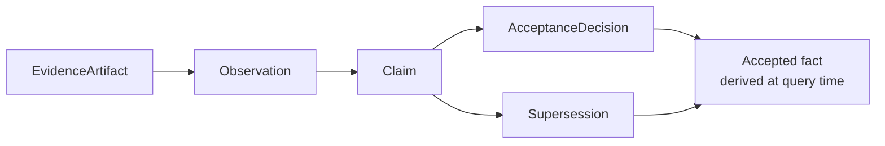
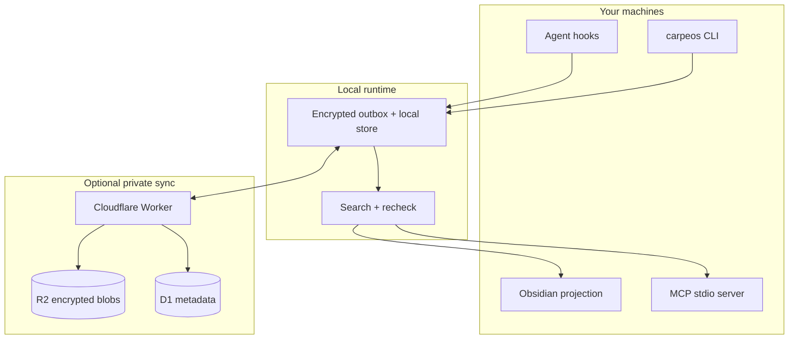
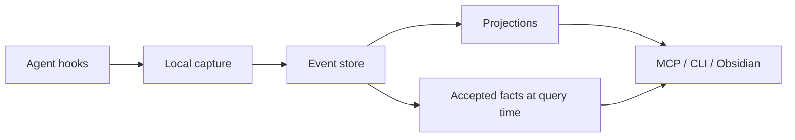

# &nbsp; CarpeOS

[English](README.md) · [한국어](README.ko.md)

[](LICENSE)
[](package.json)
[](#what-is-implemented-today)

**Capture context. Compound knowledge.**

CarpeOS is a personal knowledge system for people who work with AI agents.

It records what happened in those sessions, keeps the trail of where each piece
came from, and makes that history searchable later — by you or by another
agent — without dumping everything into one chat log.

<p align="center">
  
</p>

<p align="center">
  
</p>

---

## Why this exists

You finish a long agent session with a real decision, a half-finished plan, or
a bug path you do not want to rediscover. A week later that context is split
across chat history, terminal scrollback, and a few notes — and the next agent
has none of it.

CarpeOS is an attempt to keep that context in one place you control, with
enough structure that “we decided X” is not treated the same as “the model
once suggested X.”

| Common problem | Approach here |
| --- | --- |
| Chat history disappears or is hard to trust | Append-only events with provenance |
| “Memory” is mostly embeddings | Claims, acceptance, and supersession stay separate records |
| Each tool keeps its own silo | Shared capture + MCP retrieval, provider-agnostic |
| Generated notes become the only source of truth | Notes and indexes are rebuildable projections |
| Two machines, messy continuity | Local-first store, optional private sync |

> **Public code. Private knowledge.**  
> This repo has design, specs, and implementation. Your real sessions,
> projects, and credentials stay on your side.

---

## Who it’s for

Useful if you:

- Switch between agents (Codex, Claude Code, Grok Build, …) and do not want a
  separate memory story for each one
- Need last week’s decisions still available, not buried in an old transcript
- Care whether something is a draft, rejected, or actually accepted when you
  search for it
- Want data local by default, with sync you run yourself if you need it
- Prefer explicit schemas and tests over a black-box “memory product”

Not a polished consumer app yet. Not hosted SaaS. Not a replacement for your
editor. Closer to plumbing for people who already live in agent workflows.

---

## What’s in the box

### Capture from tools you already use

Hook templates map selected lifecycle events from Codex, Claude Code, and Grok
Build into a common capture shape. Raw payloads can sit in encrypted storage;
the event log keeps metadata and references.

### A model that does not flatten status

Evidence is not a claim. A claim is not “true” just because it exists.
Acceptance and supersession are their own records. Search can show what is
settled, what is only proposed, and what was replaced — without stuffing it all
into one paragraph of vector text.



### Interfaces for people and agents

- **CLI** — rebuild, embed (dev), `memory search` / `memory get`
- **MCP (stdio)** — eight local tools (`memory_context_pack`, `memory_trace`,
  `memory_capture`, `memory_propose_claim`, …)
- **Obsidian projection** — Markdown files generated from the local store
  (projection only; not the source of truth)

### Local first, sync optional

Each machine writes to a local outbox. There is deployable Cloudflare
Worker/D1/R2 code if you want private multi-device sync. Projections can always
be rebuilt from the event log.



---

## How it fits together



Rules worth knowing up front:

1. After acceptance, the event log is append-only.
2. “Accepted” is computed at query time — we do not rewrite a claim in place.
3. Sensitive plaintext is not stored inside the event body.
4. Trust zones are real isolation boundaries, not labels for show.
5. Notes, vectors, and context packs can be deleted and rebuilt; they are not
   the canonical store.

More detail:
[Architecture overview](docs/architecture/overview.md),
[ADRs](docs/adr/),
[spec/v1](spec/v1/).

---

## Quick start

Needs Node.js ≥ 22.22 and pnpm ≥ 11.16.

```sh
pnpm install
pnpm build

node apps/carpeos-cli/dist/index.js init
node apps/carpeos-cli/dist/index.js project identify

# one synthetic capture
node apps/carpeos-cli/dist/index.js capture-hook --provider codex --input argv \
  '{"hook_event_name":"SessionEnd","session_id":"session_synthetic","timestamp":"2026-01-01T00:00:00Z","message":"synthetic capture"}'

node apps/carpeos-cli/dist/index.js outbox status
```

| Topic | Guide |
| --- | --- |
| Local capture & hooks | [docs/guides/local-capture.md](docs/guides/local-capture.md) |
| Private Cloudflare sync | [docs/guides/cloudflare-sync.md](docs/guides/cloudflare-sync.md) |
| Retrieval CLI | [docs/guides/retrieval.md](docs/guides/retrieval.md) |
| MCP server | [docs/guides/mcp-server.md](docs/guides/mcp-server.md) |
| Obsidian projection | [docs/guides/obsidian-projection.md](docs/guides/obsidian-projection.md) |

Hook templates: [`adapters/`](adapters/).

---

## What works today

Pre-MVP. The local path — capture → outbox → sync client → retrieval → MCP →
Obsidian projection — is implemented and covered with synthetic tests in this
repo.

| Area | Status |
| --- | --- |
| Specs, ontology, ADRs | In tree |
| Local capture + outbox | Implemented (synthetic tests) |
| Sync Worker/client | Code + local tests; no production deploy claimed |
| Local hybrid retrieval | Implemented (deterministic dev embeddings) |
| MCP stdio server (8 tools) | Local only |
| Obsidian projection package | Local only |
| Hosted embeddings / GraphRAG / dashboard | Not built |
| Packaged end-user install | Not ready |

Do not treat adapter install, a live Cloudflare setup, hosted MCP, or
production search quality as done until this repo says so with tests and docs.

---

## Repo boundary

Public implementation only. Runtime knowledge stays private.

| OK here | Not OK here |
| --- | --- |
| Synthetic fixtures (`Example Alpha`, …) | Real project names or private URLs |
| Protocol examples | Real session transcripts |
| Tests and schemas | Credentials, tokens, production logs |
| Contributor docs | Runtime DB dumps, personal paths |

---

## Design influences

Some ideas overlap with
[obsidian-mind](https://github.com/breferrari/obsidian-mind) (agent memory,
hooks, retrieval for agents). CarpeOS is a separate design: append-only events
instead of a Markdown vault as authority, explicit claim/acceptance/supersession,
trust zones, protected values, and MCP that is not locked to one vendor.

---

## Contributing

See [CONTRIBUTING.md](CONTRIBUTING.md), [GOVERNANCE.md](GOVERNANCE.md), and
[AGENTS.md](AGENTS.md).

```sh
pnpm check   # format, lint, build, typecheck, test, public-boundary
```

---

## License

[Apache License 2.0](LICENSE)
