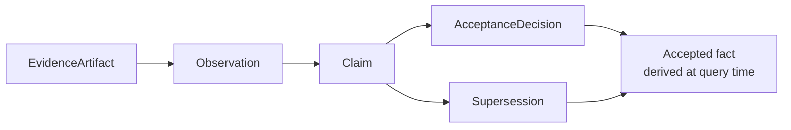
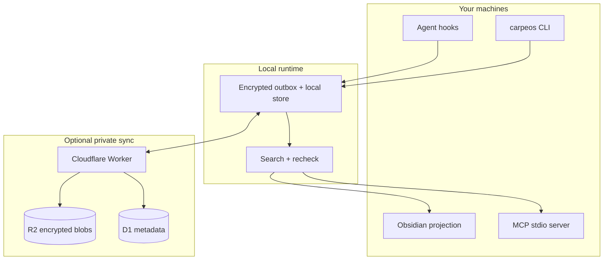
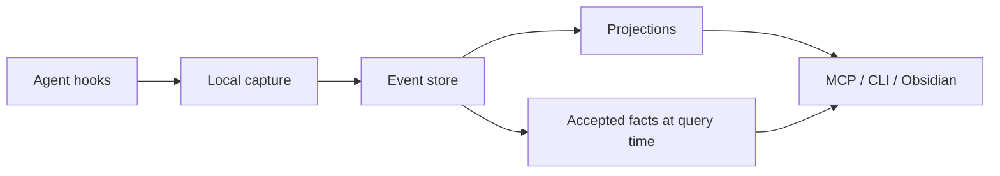

# &nbsp; CarpeOS

[English](README.md) · [한국어](README.ko.md)

[](LICENSE)
[](package.json)
[](#what-is-implemented-today)

**Capture context. Compound knowledge.**

CarpeOS is a personal knowledge system for people who work with AI agents.

It records what happened in those sessions, keeps the trail of where each piece
came from, and makes that history searchable later — by you or by another
agent — without dumping everything into one chat log.

<p align="center">
  
</p>

<p align="center">
  
</p>

---

## Why this exists

You finish a long agent session with a real decision, a half-finished plan, or
a bug path you do not want to rediscover. A week later that context is split
across chat history, terminal scrollback, and a few notes — and the next agent
has none of it.

CarpeOS is an attempt to keep that context in one place you control, with
enough structure that “we decided X” is not treated the same as “the model
once suggested X.”

| Common problem | Approach here |
| --- | --- |
| Chat history disappears or is hard to trust | Append-only events with provenance |
| “Memory” is mostly embeddings | Claims, acceptance, and supersession stay separate records |
| Each tool keeps its own silo | Shared capture + MCP retrieval, provider-agnostic |
| Generated notes become the only source of truth | Notes and indexes are rebuildable projections |
| Two machines, messy continuity | Local-first store, optional private sync |

> **Public code. Private knowledge.**  
> This repo has design, specs, and implementation. Your real sessions,
> projects, and credentials stay on your side.

---

## Who it’s for

Useful if you:

- Switch between agents (Codex, Claude Code, Grok Build, …) and do not want a
  separate memory story for each one
- Need last week’s decisions still available, not buried in an old transcript
- Care whether something is a draft, rejected, or actually accepted when you
  search for it
- Want data local by default, with sync you run yourself if you need it
- Prefer explicit schemas and tests over a black-box “memory product”

Not a polished consumer app yet. Not hosted SaaS. Not a replacement for your
editor. Closer to plumbing for people who already live in agent workflows.

---

## What’s in the box

### Capture from tools you already use

Hook templates map selected lifecycle events from Codex, Claude Code, and Grok
Build into a common capture shape. Raw payloads can sit in encrypted storage;
the event log keeps metadata and references.

### A model that does not flatten status

Evidence is not a claim. A claim is not “true” just because it exists.
Acceptance and supersession are their own records. Search can show what is
settled, what is only proposed, and what was replaced — without stuffing it all
into one paragraph of vector text.



### Interfaces for people and agents

- **CLI** — rebuild, embed (dev), `memory search` / `memory get` /
  `memory context-pack`
- **MCP (stdio)** — eight local tools (`memory_context_pack`, `memory_trace`,
  `memory_capture`, `memory_propose_claim`, …)
- **Obsidian projection** — Markdown files generated from the local store
  (projection only; not the source of truth)

### Local first, sync optional

Each machine writes to a local outbox. There is deployable Cloudflare
Worker/D1/R2 code if you want private multi-device sync. Projections can always
be rebuilt from the event log.



---

## How it fits together



Rules worth knowing up front:

1. After acceptance, the event log is append-only.
2. “Accepted” is computed at query time — we do not rewrite a claim in place.
3. Sensitive plaintext is not stored inside the event body.
4. Trust zones are real isolation boundaries, not labels for show.
5. Notes, vectors, and context packs can be deleted and rebuilt; they are not
   the canonical store.

More detail:
[Architecture overview](docs/architecture/overview.md),
[Memory capacity](docs/architecture/memory-capacity.md),
[ADR 0009](docs/adr/0009-memory-capacity-model.md),
[ADRs](docs/adr/),
[spec/v1](spec/v1/).

### Memory capacity (total vs active)

CarpeOS separates **how much private knowledge you store** from **how much an
agent loads right now**:

| Axis | Meaning | Where it lives |
| --- | --- | --- |
| **Total capacity** | Visible append-only events + protected blobs under trust zones | L1 store |
| **Active capacity** | What fits a bounded pack or search response after budgets and recheck | L2 working memory |
| **Procedural memory** | Thinking/tool traces as protected evidence, never auto-accepted | L3 |
| **Product projections** | Rebuildable notes, packs, open loops, dashboards | L4 |

Context packs use sparse **expert-slot** allocation (default 16 slots) and a
cache-friendly section order so accepted facts stay ahead of high-churn drafts.
See the [memory capacity architecture note](docs/architecture/memory-capacity.md)
and the [capacity master plan](docs/plans/k3-memory-capacity-master-plan.md).
Graph-oriented recall remains planned:
[GraphRAG roadmap](docs/plans/graphrag-roadmap.md).

---

## Install

Requires **Node.js ≥ 22.22**.

### Users

```sh
# npm (preferred)
npm install -g @innocarpe/carpeos
carpeos setup --yes

# or curl (installs the same package, then setup)
curl -fsSL https://raw.githubusercontent.com/innocarpe/carpeos/main/scripts/install.sh | bash
```

`carpeos setup` creates a private runtime under `~/.carpeos` and registers the
local MCP server with **Claude Code / Codex CLI / Grok Build** when those tools
are on `PATH`. Verify with `carpeos setup --doctor`.

Pin a version when you care about reproducibility: `npm i -g @innocarpe/carpeos@0.1.0`.
Changelog: [CHANGELOG.md](CHANGELOG.md).

### Developers (git checkout)

```sh
git clone https://github.com/innocarpe/carpeos.git && cd carpeos
node scripts/install-local.mjs --yes    # build, wrappers, MCP registration
export PATH="$HOME/.local/bin:$PATH"
node scripts/install-local.mjs --doctor
```

For monorepo work without global install: `pnpm install && pnpm build`, then use
`node apps/carpeos-cli/dist/index.js …` (see [local capture](docs/guides/local-capture.md)).

### After install (smoke)

```sh
carpeos init --home "$HOME/.carpeos" --trust-zone tz_local_default
carpeos memory context-pack \
  --task "Smoke: list what I know" \
  --trust-zone tz_local_default \
  --visible-trust-zone tz_local_default
```

Optional session **capture** still uses host hooks under [`adapters/`](adapters/)
(separate from MCP). Full notes:
[one-stop install](docs/guides/one-stop-install.md) ·
[MCP](docs/guides/mcp-server.md) ·
[context-pack smoke](docs/guides/mcp-context-pack-smoke.md).

### For agents installing this repo

Keep install **idempotent** and **out of the git tree** for private data.

1. Prefer `npm i -g @innocarpe/carpeos` + `carpeos setup --yes` (or `install.sh`).
2. If working from source: `node scripts/install-local.mjs --yes` from the checkout.
3. Never commit `~/.carpeos`, credentials, or real session data.
4. Do not invent alternate install paths; setup registers MCP for Claude/Codex/Grok.
5. Releases use SemVer + `vX.Y.Z` tags only — see
   [versioning](docs/maintainers/versioning-and-releases.md) and skill
   `skills/carpeos-release/SKILL.md` (`./scripts/install-release-skill.sh`).

| Guide | Link |
| --- | --- |
| Install (all paths) | [docs/guides/one-stop-install.md](docs/guides/one-stop-install.md) |
| Capture & hooks | [docs/guides/local-capture.md](docs/guides/local-capture.md) |
| Retrieval / context-pack CLI | [docs/guides/retrieval.md](docs/guides/retrieval.md) |
| MCP | [docs/guides/mcp-server.md](docs/guides/mcp-server.md) |
| Versioning & releases | [docs/maintainers/versioning-and-releases.md](docs/maintainers/versioning-and-releases.md) |
| Sync / multi-Mac | [docs/guides/cross-mac-bootstrap-recovery.md](docs/guides/cross-mac-bootstrap-recovery.md) |

---

## What works today

Pre-MVP. The local path — capture → outbox → sync client → retrieval → MCP →
Obsidian projection — is implemented and covered with synthetic tests in this
repo.

G008 adds release-readiness documentation and a synthetic local end-to-end
proof. On Node 22.22.0, `pnpm check` passes, and the opt-in synthetic local
Worker+D1+R2 gate passes with
`pnpm --filter @carpeos/sync-worker test:e2e`. This is local evidence only.

| Area | Status |
| --- | --- |
| Specs, ontology, ADRs | In tree |
| Local capture + outbox | Implemented (synthetic tests) |
| Sync Worker/client | Code + local tests; no production deploy claimed |
| Local hybrid retrieval | Implemented (deterministic dev embeddings) |
| MCP stdio server (8 tools) | Local only |
| Expert-slot context packs | CLI + MCP (local) |
| `carpeos setup` / one-stop install | In tree; npm package `@innocarpe/carpeos` |
| OpenLoop / dashboard library | Library + tests; not a shipped UI |
| Obsidian projection package | Local only |
| Synthetic G008 local e2e | Local only; opt-in Worker+D1+R2 proof |
| Hosted embeddings | Not built |
| GraphRAG traversal | Planned — [roadmap](docs/plans/graphrag-roadmap.md) |
| Hosted multi-tenant SaaS | Not a goal of this repo |

**NOT DEPLOYED:** no hosted Worker, D1/R2 production resources, private vault
adoption, or hosted MCP is proven by this repository. npm publish is gated by
SemVer tags + CI ([versioning](docs/maintainers/versioning-and-releases.md)).

Do not treat adapter install, a live Cloudflare setup, hosted MCP, or
production search quality as done until this repo says so with tests and docs.

---

## Repo boundary

Public implementation only. Runtime knowledge stays private.

| OK here | Not OK here |
| --- | --- |
| Synthetic fixtures (`Example Alpha`, …) | Real project names or private URLs |
| Protocol examples | Real session transcripts |
| Tests and schemas | Credentials, tokens, production logs |
| Contributor docs | Runtime DB dumps, personal paths |

---

## Design influences

Some ideas overlap with
[obsidian-mind](https://github.com/breferrari/obsidian-mind) (agent memory,
hooks, retrieval for agents). CarpeOS is a separate design: append-only events
instead of a Markdown vault as authority, explicit claim/acceptance/supersession,
trust zones, protected values, and MCP that is not locked to one vendor.

---

## Contributing

See [CONTRIBUTING.md](CONTRIBUTING.md), [GOVERNANCE.md](GOVERNANCE.md), and
[AGENTS.md](AGENTS.md).

```sh
pnpm check   # format, lint, build, typecheck, test, public-boundary
```

Public package releases use one shared process (any coding agent should follow
the same skill):

```sh
./scripts/install-release-skill.sh   # Claude / Codex / Grok skill links
# then: release / tag / npm — see skills/carpeos-release/SKILL.md
```

---

## License

[Apache License 2.0](LICENSE)
