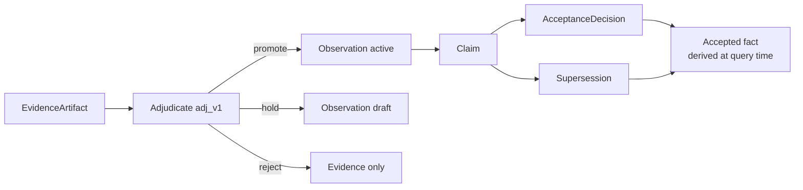
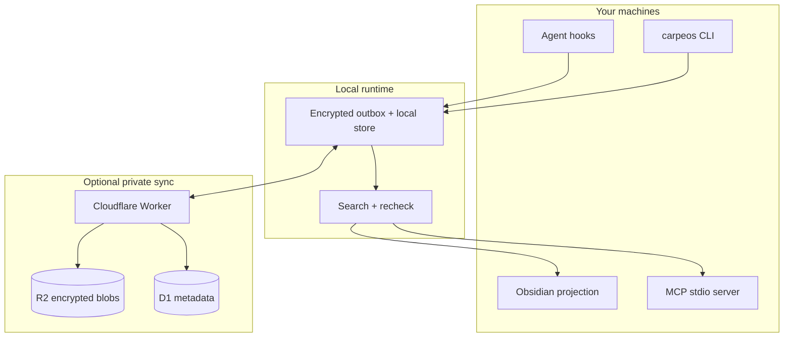
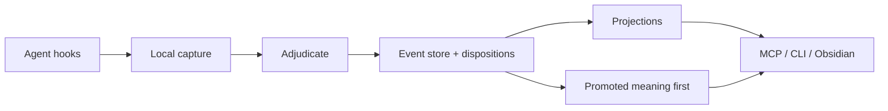

# &nbsp; CarpeOS

[English](README.md) · [한국어](README.ko.md)

[](https://www.npmjs.com/package/@innocarpe/carpeos)
[](https://github.com/innocarpe/CarpeOS/actions/workflows/ci.yml)
[](LICENSE)
[](package.json)
[](https://github.com/innocarpe/CarpeOS/releases/latest)
[](https://innocarpe.github.io/carpeos-website/)

**Capture context. Compound knowledge.**

CarpeOS is a personal knowledge OS for AI-assisted work. It captures agent
sessions with provenance, **adjudicates** what is worth keeping as durable
meaning (`promote` | `hold` | `reject`), keeps accepted decisions searchable,
and helps you and your agents retrieve that context later via MCP, CLI, and
Obsidian — all local-first.

It keeps the trail of where each piece came from **without** turning every
session dump into “memory.”

**Latest release:** [`@innocarpe/carpeos@2.0.0`](https://www.npmjs.com/package/@innocarpe/carpeos)
([notes](CHANGELOG.md) · [product 2.0 DoD](docs/maintainers/product-2.0.0.md)).
**Next major (`3.0.0`)** is in active development (not frozen; no tag yet).

<p align="center">
  
</p>

<p align="center">
  
</p>

## Website

Visit **[the CarpeOS website](https://innocarpe.github.io/carpeos-website/)** for
the product overview, system model, install path, and public documentation guide.

---

## Why this exists

You finish a long agent session with a real decision, a half-finished plan, or
a bug path you do not want to rediscover. A week later that context is split
across chat history, terminal scrollback, and a few notes — and the next agent
has none of it.

CarpeOS is an attempt to keep that context in one place you control, with
enough structure that “we decided X” is not treated the same as “the model
once suggested X.”

| Common problem | Approach here |
| --- | --- |
| Chat history disappears or is hard to trust | Append-only events with provenance |
| Session noise floods “memory” | Post-capture adjudication; default search is **promoted only** |
| “Memory” is mostly embeddings | Claims, acceptance, and supersession stay separate records |
| Each tool keeps its own silo | Shared capture + MCP retrieval, provider-agnostic |
| Generated notes become the only source of truth | Notes and indexes are rebuildable projections |
| Two machines, messy continuity | Local-first store, optional private sync |

> **Public code. Private knowledge.**  
> This repo has design, specs, and implementation. Your real sessions,
> projects, and credentials stay on your side.

---

## Who it’s for

Useful if you:

- Switch between agents (Codex, Claude Code, Grok Build, …) and do not want a
  separate memory story for each one
- Need last week’s decisions still available, not buried in an old transcript
- Care whether something is a draft, rejected, or actually accepted when you
  search for it
- Want data local by default, with sync you run yourself if you need it
- Prefer explicit schemas and tests over a black-box “memory product”

Not a polished consumer app yet. Not hosted SaaS. Not a replacement for your
editor. Closer to plumbing for people who already live in agent workflows.

---

## What’s in the box

### Capture from tools you already use

Hooks map selected lifecycle events from Codex, Claude Code, and Grok Build into
a common capture shape. Raw payloads sit in encrypted storage; the event log
keeps metadata and references. Host hooks stay **fail-open and fast**.

### Adjudicate before “memory”

After capture, a precision-first rule adjudicator (`adj_v1`) decides disposition:

| Disposition | Meaning unit | Default search |
| --- | --- | --- |
| **promote** | Active Observation | Included |
| **hold** | Draft Observation (review queue) | Excluded unless `--include-held` / `include_held` |
| **reject** | Disposition only (evidence may remain) | Excluded |

Operators can review holds (`carpeos adjudicate list-held|promote-held|reject-held`),
inspect policy history, and re-run under a new policy version. Adjudication
**never** auto-creates an `AcceptanceDecision`.

### A model that does not flatten status

Evidence is not a claim. A claim is not “true” just because it exists.
Acceptance and supersession are their own records. Search can show what is
settled, what is only proposed, and what was replaced — without stuffing it all
into one paragraph of vector text.



### Interfaces for people and agents

- **CLI** — `capture-hook`, `extract`, **`adjudicate`**, `retrieval rebuild`,
  `memory search|get|context-pack` (default promoted-only; `--include-held` opt-in),
  `sync status|push|pull|once|cycle`
- **MCP (stdio)** — eight local tools (`memory_search`, `memory_get`,
  `memory_context_pack`, `memory_trace`, `memory_timeline`, `memory_related`,
  `memory_capture`, `memory_propose_claim`)
- **Obsidian projection** — Markdown files generated from the local store
  (projection only; not the source of truth)

### Local first, sync optional

Each machine writes to a local outbox. There is deployable Cloudflare
Worker/D1/R2 code if you want private multi-device sync, plus a **bounded**
`carpeos sync cycle` for operator loops. Projections can always be rebuilt from
the event log.



---

## How it fits together



Rules worth knowing up front:

1. The event log is append-only; dispositions are append-only by policy version.
2. Default search is **promoted/active** meaning — not every captured session.
3. “Accepted” is computed at query time — we do not rewrite a claim in place.
4. Sensitive plaintext is not stored inside the event body.
5. Trust zones are real isolation boundaries, not labels for show.
6. Notes, vectors, and context packs can be deleted and rebuilt; they are not
   the canonical store.

More detail:
[Architecture overview](docs/architecture/overview.md),
[Memory capacity](docs/architecture/memory-capacity.md),
[ADR 0009](docs/adr/0009-memory-capacity-model.md),
[ADRs](docs/adr/),
[spec/v1](spec/v1/).

### Memory capacity (total vs active)

CarpeOS separates **how much private knowledge you store** from **how much an
agent loads right now**:

| Axis | Meaning | Where it lives |
| --- | --- | --- |
| **Total capacity** | Visible append-only events + protected blobs under trust zones | L1 store |
| **Active capacity** | What fits a bounded pack or search response after budgets and recheck | L2 working memory |
| **Procedural memory** | Thinking/tool traces as protected evidence, never auto-accepted | L3 |
| **Product projections** | Rebuildable notes, packs, open loops, dashboards | L4 |

Context packs use sparse **expert-slot** allocation (default 16 slots) and a
cache-friendly section order so accepted facts stay ahead of high-churn drafts.
See the [memory capacity architecture note](docs/architecture/memory-capacity.md)
and the [capacity master plan](docs/plans/k3-memory-capacity-master-plan.md).
Graph-oriented recall remains planned:
[GraphRAG roadmap](docs/plans/graphrag-roadmap.md).

---

## Install

Requires **Node.js ≥ 22.22**.

### Users

```sh
# npm (preferred)
npm install -g @innocarpe/carpeos
carpeos setup plan              # see paths + actions (no changes)
carpeos setup run --apply       # apply defaults

# or curl (installs the same package, then setup run --apply)
curl -fsSL https://raw.githubusercontent.com/innocarpe/carpeos/main/scripts/install.sh | bash
```

`carpeos setup` is a real CLI surface — not a flag dump. Default paths land under
`~/.carpeos` and `~/.local/bin`; MCP registers with **Claude Code / Codex CLI /
Grok Build** when those tools are on `PATH`.

```sh
carpeos setup --help            # full parameter interface
carpeos setup plan              # resolved plan only
carpeos setup run --apply       # apply the plan (home, wrappers, MCP)
carpeos setup hooks install --apply   # capture hooks (merge-safe; product path)
carpeos setup doctor            # verify install + hooks + store signals
carpeos setup show              # print config.json
```

Useful options: `--home`, `--bin-dir`, `--workspace-root`, `--trust-zone`,
`--register-mcp auto|none|claude,codex,grok`, `--register-hooks auto|none|…`.
Setup never mutates the machine without `--apply`.

Pin a version when you care about reproducibility:
`npm i -g @innocarpe/carpeos@2.0.0`. Changelog: [CHANGELOG.md](CHANGELOG.md).
Product milestones: [1.0 DoD](docs/maintainers/product-1.0.0.md) (pipeline) ·
[2.0 DoD](docs/maintainers/product-2.0.0.md) (adjudication, shipped as package 2.0.0).

### Developers (git checkout)

```sh
git clone https://github.com/innocarpe/carpeos.git && cd carpeos
node scripts/install-local.mjs plan
node scripts/install-local.mjs run --apply   # build, wrappers, MCP registration
node scripts/install-local.mjs hooks install --apply
export PATH="$HOME/.local/bin:$PATH"
node scripts/install-local.mjs doctor
```

For monorepo work without global install: `pnpm install && pnpm build`, then use
`node apps/carpeos-cli/dist/index.js …` (see [local capture](docs/guides/local-capture.md)).

### Product path: install → session → adjudicate → search

```sh
# 1) Runtime + MCP
carpeos setup run --apply
# 2) Capture hooks (Claude / Codex / Grok; merge-safe, does not wipe user hooks)
carpeos setup hooks install --apply
# 3) Doctor (hooks, store, adjudication health, promoted-only default search)
carpeos setup doctor
# 4) After a host session (or synthetic capture-hook), rebuild + search promoted meaning
carpeos retrieval rebuild --trust-zone tz_local_default
carpeos memory search \
  --query "durable decision" \
  --trust-zone tz_local_default \
  --visible-trust-zone tz_local_default
# optional: include held/draft
# carpeos memory search --include-held --query "…" …

# Operator review queue (held drafts)
carpeos adjudicate --stats
carpeos adjudicate list-held --limit 50
# carpeos adjudicate promote-held --event-id evt_…
# carpeos adjudicate reject-held --event-id evt_…
```

`carpeos setup doctor` reports hook install status, recent `EvidenceArtifact`
activity, Observation/Claim counts, **adjudication policy version + promote/hold/reject
counts**, and that **default search is promoted/active only** (empty store → warnings,
not fail).

Automated gates:

| Gate | What it proves |
| --- | --- |
| `pnpm smoke:product` | 1.0 pipeline loop (capture → extract path → search) |
| `pnpm smoke:knowledge` | 2.0 promote vs noise reject |
| `pnpm smoke:dogfood` | multi-hook public-safe noise scenarios |
| `pnpm smoke:mcp` | MCP tool surface |

Advanced/manual hook templates remain under [`adapters/`](adapters/). Full notes:
[one-stop install](docs/guides/one-stop-install.md) ·
[MCP](docs/guides/mcp-server.md) ·
[product smoke](docs/guides/mcp-context-pack-smoke.md).

### For agents installing this repo

Keep install **idempotent** and **out of the git tree** for private data.

1. Prefer `npm i -g @innocarpe/carpeos` + `carpeos setup plan` then
   `carpeos setup run --apply` (or `install.sh`).
2. Install capture hooks: `carpeos setup hooks install --apply`.
3. If working from source: `node scripts/install-local.mjs run --apply` from the checkout.
4. Never commit `~/.carpeos`, credentials, or real session data.
5. Do not invent alternate install paths; setup registers MCP and (optionally) hooks.
6. Releases use SemVer + `vX.Y.Z` tags only — see
   [versioning](docs/maintainers/versioning-and-releases.md) and skill
   `skills/carpeos-release/SKILL.md` (`./scripts/install-release-skill.sh`).
   Follow SemVer; do not invent tags outside the release skill.

| Guide | Link |
| --- | --- |
| Install (all paths) | [docs/guides/one-stop-install.md](docs/guides/one-stop-install.md) |
| Capture & hooks | [docs/guides/local-capture.md](docs/guides/local-capture.md) |
| Retrieval / context-pack CLI | [docs/guides/retrieval.md](docs/guides/retrieval.md) |
| MCP | [docs/guides/mcp-server.md](docs/guides/mcp-server.md) |
| MCP tool contract | [docs/contracts/mcp-tools-v1.md](docs/contracts/mcp-tools-v1.md) |
| Cloudflare / sync | [docs/guides/cloudflare-sync.md](docs/guides/cloudflare-sync.md) |
| Smokes | `pnpm smoke:mcp` · `smoke:product` · `smoke:knowledge` · `smoke:dogfood` |
| Changelog | [CHANGELOG.md](CHANGELOG.md) |
| Product 1.0 DoD (pipeline) | [docs/maintainers/product-1.0.0.md](docs/maintainers/product-1.0.0.md) |
| Product 2.0 DoD (adjudication) | [docs/maintainers/product-2.0.0.md](docs/maintainers/product-2.0.0.md) |
| Versioning & releases | [docs/maintainers/versioning-and-releases.md](docs/maintainers/versioning-and-releases.md) |
| Compatibility / deprecations | [docs/maintainers/compatibility-and-deprecations.md](docs/maintainers/compatibility-and-deprecations.md) |
| Local store migrations | [docs/architecture/local-store-migrations.md](docs/architecture/local-store-migrations.md) |
| Sync / multi-Mac | [docs/guides/cross-mac-bootstrap-recovery.md](docs/guides/cross-mac-bootstrap-recovery.md) |
| Memory capacity plan | [docs/plans/k3-memory-capacity-master-plan.md](docs/plans/k3-memory-capacity-master-plan.md) |

---

## Product line (1.0 → 2.0 → 3.0)

| Package / product | Meaning | Status |
| --- | --- | --- |
| **1.0.0** | Local **pipeline + contract** freeze (hooks → evidence → extract shell → search) | **Shipped** — infrastructure baseline; not “finished knowledge OS” |
| **2.0.0** | **Adjudicated meaning** as the default product contract (`adj_v1`, promoted-only search, held review, doctor, smokes) | **Shipped** on npm / `v2.0.0` — operator-real MVP, not brain-level omniscience |
| **3.0.0** | Next major product step (in development) | **Active development** — no freeze / no tag yet |

Honest residual risks after 2.0.0 (still true): golden/dogfood fixtures are synthetic;
session de-noising is limited; adjudicated **Claim** drafts remain deferred; older-policy
active units may need optional cleanup. Details:
[product-2.0.0 residual risk](docs/maintainers/product-2.0.0.md).

Capacity / pack economics and long-horizon structure work continue under the
[memory capacity master plan](docs/plans/k3-memory-capacity-master-plan.md) and
may feed **3.0** — that is **not** a freeze decision.

---

## What works today

**Published:** [`@innocarpe/carpeos@2.0.0`](https://www.npmjs.com/package/@innocarpe/carpeos)
([GitHub Release](https://github.com/innocarpe/CarpeOS/releases/tag/v2.0.0) ·
[CHANGELOG](CHANGELOG.md#200---2026-07-30)).

Default local loop (CI-gated):

```text
hooks → encrypted evidence → adjudicate (promote|hold|reject)
  → promoted meaning → retrieval / MCP / CLI
  (+ optional private sync, Obsidian projection)
```

| Area | Status |
| --- | --- |
| Specs, ontology, ADRs | In tree (incl. [ADR 0012](docs/adr/0012-knowledge-adjudication.md)) |
| Local capture + outbox | Shipped |
| Knowledge adjudication (`adj_v1`) | Shipped — dispositions, held review, policy history |
| Default retrieval | **Promoted/active only**; held opt-in |
| Doctor adjudication health | Shipped (`setup doctor`, `adjudicate --stats`) |
| Sync Worker/client + bounded `sync cycle` | Code + local tests; no production edge claimed |
| MCP stdio server (8 tools) | Local only |
| Expert-slot context packs | CLI + MCP (local) |
| `carpeos setup` / one-stop install | npm package `@innocarpe/carpeos` |
| OpenLoop / dashboard library | Library + tests; not a shipped UI |
| Obsidian projection | Local only |
| Hosted embeddings / multi-tenant SaaS | Not goals of this repo |
| GraphRAG traversal | Planned — [roadmap](docs/plans/graphrag-roadmap.md) |
| **3.0.0 product freeze** | Not done — in development |

**NOT DEPLOYED:** no hosted Worker, D1/R2 production resources, private vault
adoption, or hosted MCP is proven by this repository. npm publish is gated by
SemVer tags + CI ([versioning](docs/maintainers/versioning-and-releases.md)).

Do not treat adapter install, a live Cloudflare setup, hosted MCP, or
calibrated human-level judgment as finished until this repo says so with tests and docs.

---

## Repo boundary

Public implementation only. Runtime knowledge stays private.

| OK here | Not OK here |
| --- | --- |
| Synthetic fixtures (`Example Alpha`, …) | Real project names or private URLs |
| Protocol examples | Real session transcripts |
| Tests and schemas | Credentials, tokens, production logs |
| Contributor docs | Runtime DB dumps, personal paths |

---

## Design influences

Some ideas overlap with
[obsidian-mind](https://github.com/breferrari/obsidian-mind) (agent memory,
hooks, retrieval for agents). CarpeOS is a separate design: append-only events
instead of a Markdown vault as authority, explicit claim/acceptance/supersession,
trust zones, protected values, and MCP that is not locked to one vendor.

---

## Contributing

See [CONTRIBUTING.md](CONTRIBUTING.md), [GOVERNANCE.md](GOVERNANCE.md), and
[AGENTS.md](AGENTS.md).

```sh
pnpm check   # format, lint, build, typecheck, test, public-boundary
```

Public package releases use one shared process (any coding agent should follow
the same skill):

```sh
./scripts/install-release-skill.sh   # Claude / Codex / Grok skill links
# then: release / tag / npm — see skills/carpeos-release/SKILL.md
```

---

## License

[Apache License 2.0](LICENSE)
