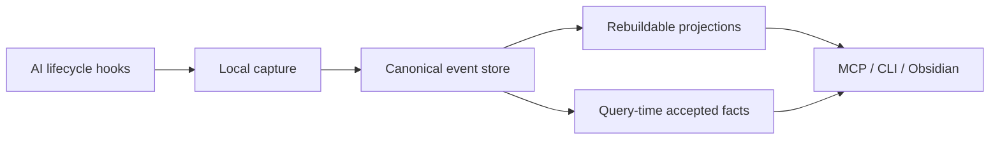

# &nbsp; CarpeOS

[English](README.md) · [한국어](README.ko.md)

[](LICENSE)
[](package.json)
[](#what-is-implemented-today)

**Capture context. Compound knowledge.**

CarpeOS is a **personal knowledge operating system for AI-assisted work**.

It captures what your agents do, turns that work into provenance-aware knowledge,
and gives both **humans and LLMs** a reliable way to retrieve it later — across
sessions, tools, and machines.

<p align="center">
  
</p>

<p align="center">
  
</p>

---

## Why CarpeOS exists

Modern AI work leaves valuable residue — decisions, failed paths, accepted
facts, open questions — then scatters it across chat transcripts, terminals,
and notes. Next session, the next agent starts cold.

CarpeOS treats that residue as a **durable knowledge plane**:

| Pain today | What CarpeOS aims for |
| --- | --- |
| Chat history is ephemeral and hard to trust | Append-only events with provenance |
| “Memory” is a bag of embeddings | Claims, acceptance, and supersession stay separate |
| Each agent has its own silo | Provider-neutral capture + shared MCP retrieval |
| Notes and indexes become the source of truth | Rebuildable projections over a private canonical store |
| Cross-device continuity is messy | Local-first capture with private sync |

> **Public implementation. Private knowledge.**  
> This repository ships design, specs, and code. It never stores your real
> sessions, projects, or credentials.

---

## When you should use it

CarpeOS is a good fit when you:

- **Live in multiple AI agents** (Codex, Claude Code, Grok Build, …) and want
  one memory plane instead of five chat histories.
- **Need decisions to survive** the next session — not just “the model once said so.”
- **Care about authority** — draft claims, rejected claims, and accepted facts
  should not look the same in retrieval.
- **Want local-first privacy** with an optional private cloud sync path you
  operate yourself.
- **Prefer contracts over vibes** — schemas, trust zones, erasure, and tests as
  first-class artifacts.

It is **not** (yet) a packaged end-user product, a hosted SaaS memory service,
or a replacement for your editor. It is infrastructure for people who build
with agents every day and want knowledge that compounds.

---

## What you get

### Capture from the agents you already use

Hook templates normalize selected lifecycle events from Codex, Claude Code, and
Grok Build into a provider-neutral capture envelope. Raw payloads can stay in
encrypted protected-value storage; the canonical layer keeps metadata and
references.

### A knowledge model that preserves authority

Evidence is not a claim. A claim is not an accepted fact. Acceptance and
supersession are separate immutable records. Retrieval can therefore surface
**what is known, what is proposed, and what was overturned** without flattening
everything into one blob of text.


### Retrieval humans and agents can share

- **CLI** — rebuild projections, embed (dev), `memory search` / `memory get`
- **MCP (stdio)** — eight local tools including `memory_context_pack`,
  `memory_trace`, `memory_capture`, and `memory_propose_claim`
- **Obsidian projection** — manifest-bounded Markdown generated from the local
  store (projection only; not canonical authority)

### Local-first, privately syncable

Each device writes an append-only outbox. A Cloudflare Worker/D1/R2 path exists
as deployable code for private operators. Projections can always be rebuilt from
canonical events.


---

## How it works

At a high level:



**Invariants that matter to users:**

1. Canonical events are append-only after acceptance.
2. Accepted facts are **derived at query time** — claims are never mutated into
   “accepted.”
3. Protected plaintext stays outside the canonical event body.
4. Trust zones are physical isolation boundaries, not cosmetic tags.
5. Notes, vectors, and context packs are projections: rebuildable and
   non-authoritative.

Deeper design lives in
[Architecture overview](docs/architecture/overview.md),
[ADRs](docs/adr/), and
[spec/v1](spec/v1/).

---

## Quick start

**Prerequisites:** Node.js ≥ 22.22, pnpm ≥ 11.16.

```sh
pnpm install
pnpm build

# initialize local runtime
node apps/carpeos-cli/dist/index.js init
node apps/carpeos-cli/dist/index.js project identify

# capture one synthetic hook payload
node apps/carpeos-cli/dist/index.js capture-hook --provider codex --input argv \
  '{"hook_event_name":"SessionEnd","session_id":"session_synthetic","timestamp":"2026-01-01T00:00:00Z","message":"synthetic capture"}'

node apps/carpeos-cli/dist/index.js outbox status
```

Guides:

| Path | Guide |
| --- | --- |
| Local capture & hooks | [docs/guides/local-capture.md](docs/guides/local-capture.md) |
| Private Cloudflare sync | [docs/guides/cloudflare-sync.md](docs/guides/cloudflare-sync.md) |
| Retrieval & memory CLI | [docs/guides/retrieval.md](docs/guides/retrieval.md) |
| MCP server setup | [docs/guides/mcp-server.md](docs/guides/mcp-server.md) |
| Obsidian projection | [docs/guides/obsidian-projection.md](docs/guides/obsidian-projection.md) |

Adapter templates for Codex, Claude Code, and Grok Build live under
[`adapters/`](adapters/).

---

## What is implemented today

CarpeOS is **pre-MVP**. The local path through capture → outbox → sync client →
retrieval → MCP → Obsidian projection is implemented with **synthetic test
coverage** in this monorepo.

| Area | Status |
| --- | --- |
| Specs, ontology, ADRs | Present |
| Local capture + durable outbox | Implemented (tested with synthetic data) |
| Sync Worker/client (Cloudflare path) | Deployable code + local tests — no live deploy claimed |
| Hybrid local retrieval | Implemented with deterministic dev embeddings |
| MCP stdio server (8 tools) | Implemented locally |
| Obsidian projection package | Implemented locally |
| Hosted embeddings / GraphRAG / dashboard | Planned, not active features |
| Packaged end-user distribution | Not ready |

Do not treat adapter install, production Cloudflare provisioning, hosted MCP,
or production semantic quality as finished until they are tested and documented
as such here.

---

## Repository boundary

This repo is the public implementation. Runtime knowledge stays private.

| OK in this repo | Never in this repo |
| --- | --- |
| Synthetic fixtures (`Example Alpha`, …) | Real project names or private URLs |
| Protocol examples | Real session transcripts |
| Tests and schemas | Credentials, tokens, production logs |
| Contributor docs | Exported runtime databases / local user paths |

---

## Design influences

CarpeOS was inspired in part by
[obsidian-mind](https://github.com/breferrari/obsidian-mind) — durable agent
memory, lifecycle hooks, and semantic retrieval through an agent-facing
interface.

CarpeOS is an independent design: append-only canonical events (not a Markdown
vault as authority), explicit claim/acceptance/supersession semantics, trust
zones, protected values, and provider-neutral MCP access.

---

## Contributing

See [CONTRIBUTING.md](CONTRIBUTING.md), [GOVERNANCE.md](GOVERNANCE.md), and
[AGENTS.md](AGENTS.md).

```sh
pnpm check   # format, lint, build, typecheck, test, public-boundary
```

Label guidance for PRs is intentionally light: one kind label
(`feat` / `fix` / `docs` / `spec` / `chore`) plus an optional area. Details in
[docs/maintainers/github-labels.md](docs/maintainers/github-labels.md).

---

## License

[Apache License 2.0](LICENSE)
