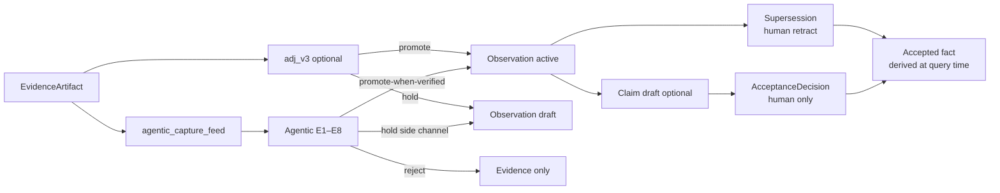
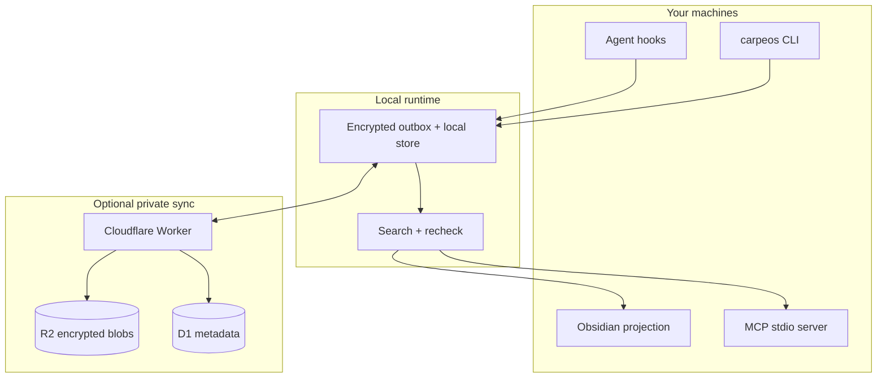
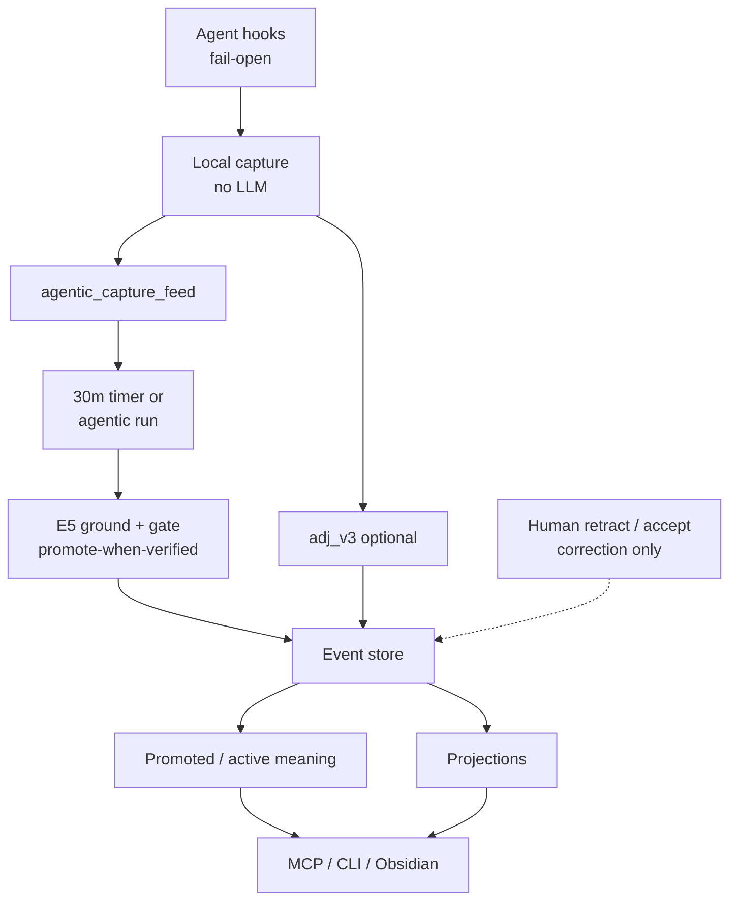

# &nbsp; CarpeOS

[English](README.md) · [한국어](README.ko.md)

[](https://www.npmjs.com/package/@innocarpe/carpeos)
[](https://github.com/innocarpe/CarpeOS/actions/workflows/ci.yml)
[](LICENSE)
[](package.json)
[](https://github.com/innocarpe/CarpeOS/releases/latest)
[](https://innocarpe.github.io/carpeos-website/)

**Capture context. Compound knowledge.**

CarpeOS is a personal knowledge OS for AI-assisted work. It captures agent
sessions with provenance, forms **durable meaning** at write time (cheap
`adj_v3` rules plus a post-capture **Agentic Layer**), keeps promoted decisions
searchable by default, and helps you and your agents retrieve that context later
via MCP, CLI, and Obsidian — all local-first, **without required human review**
on the happy path.

It keeps the trail of where each piece came from **without** turning every
session dump into “memory.”

**Latest package:** [`@innocarpe/carpeos@6.7.7`](https://www.npmjs.com/package/@innocarpe/carpeos)
([CHANGELOG](CHANGELOG.md) · [`v6.7.7`](https://github.com/innocarpe/CarpeOS/releases/tag/v6.7.7)).

<p align="center">
  
</p>

<p align="center">
  
</p>

## Website

Visit **[the CarpeOS website](https://innocarpe.github.io/carpeos-website/)** for
the product overview, system model, install path, and public documentation guide.

---

## Why this exists

You finish a long agent session with a real decision, a half-finished plan, or
a bug path you do not want to rediscover. A week later that context is split
across chat history, terminal scrollback, and a few notes — and the next agent
has none of it.

CarpeOS is an attempt to keep that context in one place you control, with
enough structure that “we decided X” is not treated the same as “the model
once suggested X.”

| Common problem | Approach here |
| --- | --- |
| Chat history disappears or is hard to trust | Append-only events with provenance |
| Session noise floods “memory” | Post-capture adjudication + agentic gate; default search is **promoted only** |
| Next agent forgets last session’s decisions | HITL-free Agentic Layer promotes verified meaning for default retrieval |
| “Memory” is mostly embeddings | Claims, acceptance, and supersession stay separate records |
| Each tool keeps its own silo | Shared capture + MCP retrieval, provider-agnostic |
| Generated notes become the only source of truth | Notes and indexes are rebuildable projections |
| Two machines, messy continuity | Local-first store, optional private sync |

> **Public code. Private knowledge.**  
> This repo has design, specs, and implementation. Your real sessions,
> projects, and credentials stay on your side.

---

## Who it’s for

Useful if you:

- Switch between agents (Codex, Claude Code, Grok Build, …) and do not want a
  separate memory story for each one
- Need last week’s decisions still available, not buried in an old transcript
- Care whether something is a draft, rejected, or actually accepted when you
  search for it
- Want data local by default, with sync you run yourself if you need it
- Prefer explicit schemas and tests over a black-box “memory product”

Not a polished consumer app yet. Not hosted SaaS. Not a replacement for your
editor. Closer to plumbing for people who already live in agent workflows.

---

## What’s in the box

### Capture from tools you already use

Hooks map selected lifecycle events from Codex, Claude Code, and Grok Build into
a common capture shape. Raw payloads sit in encrypted storage; the event log
keeps metadata and references. Host hooks stay **fail-open and fast**.

### Form meaning before “memory” (two planes)

After capture, two write-time paths can assign what is worth keeping:

| Plane | Role | Default path |
| --- | --- | --- |
| **`adj_v3`** | Cheap rule prefilter / noise reject | Still available; comparison baseline |
| **Agentic Layer** (`agentic_v1.1`) | Typed, cited brain (Flash-only when network on) + **quality plane** | **Product 6 happy path** from 6.6.0; quality ultragoal closed through **6.7.7** |

| Disposition | Meaning unit | Default search |
| --- | --- | --- |
| **promote** | Active Observation | Included |
| **hold** | Draft Observation (side channel) | Excluded unless `--include-held` / `include_held` |
| **reject** | Disposition only (evidence may remain) | Excluded |

**Agentic (ADR 0018):** verified allowlisted extracts (`decision` /
`constraint` / `preference`) **promote by default** when E5 grounds the
statement in cited spans — no human click required. `procedure` and
`fact_candidate` stay hold-biased. Humans **retract** mistakes, optionally
**accept-claim**, or clear holds — correction only.

Held review remains policy-aware and append-only for both planes. Neither path
automatically creates an `AcceptanceDecision`.

`adj_v3` foundation (3.2+) and B0 policy reconciliation preview remain available:

```sh
carpeos adjudicate reconcile-policy \
  --from-policy adj_v1 --to-policy adj_v3 \
  --trust-zone tz_synthetic --limit 100
```

B0 is metadata-only and supports only these exact flags: `--from-policy`, `--to-policy`,
`--trust-zone`, and `--limit`. `--apply`, `--apply-safe-subset`, acknowledgements, receipts,
and Supersession construction are unsupported. B1 write/apply/receipt work remains deferred.
Dogfood inputs and outputs are synthetic and disposable.

### A model that does not flatten status

Evidence is not a claim. A claim is not “true” just because it exists.
Acceptance and supersession are their own records. Search can show what is
settled, what is only proposed, and what was replaced — without stuffing it all
into one paragraph of vector text.



### Interfaces for people and agents

- **CLI** — `capture-hook`, `extract`, **`adjudicate`**, **`agentic`** (run /
  timer / retract / golden / graphrag…), `retrieval rebuild`,
  `memory search|get|context-pack` (default promoted-only; `--include-held`
  opt-in), `sync status|push|pull|once|cycle`
- **MCP (stdio)** — eight local tools (`memory_search`, `memory_get`,
  `memory_context_pack`, `memory_trace`, `memory_timeline`, `memory_related`,
  `memory_capture`, `memory_propose_claim`)
- **Always-on agentic** — optional 30m timer:
  `carpeos agentic timer install` (network off by default)
- **Obsidian projection** — Markdown files generated from the local store
  (projection only; not the source of truth)
- **OKF v0.2 export projection** — `carpeos okf export|rebuild` writes a
  trust-zone-scoped, promoted/active-by-default portable bundle; it is not
  canonical storage or an import path ([guide](docs/guides/okf-export.md))

### Local first, sync optional

Each machine writes to a local outbox. There is deployable Cloudflare
Worker/D1/R2 code if you want private multi-device sync, plus a **bounded**
`carpeos sync cycle` for operator loops. Projections can always be rebuilt from
the event log.



---

## How it fits together



Rules worth knowing up front:

1. The event log is append-only; dispositions are append-only by policy version.
2. Default search is **promoted/active** meaning — not every captured session.
3. Agentic **promote-when-verified** closes the loop without load-bearing HITL
   (ADR 0018); formal `AcceptanceDecision` is still human-only and optional.
4. “Accepted” is computed at query time — we do not rewrite a claim in place.
5. Sensitive plaintext is not stored inside the event body.
6. Trust zones are real isolation boundaries, not labels for show.
7. Notes, vectors, and context packs can be deleted and rebuilt; they are not
   the canonical store.

More detail:
[Architecture overview](docs/architecture/overview.md),
[Agentic Layer](docs/architecture/agentic-layer.md),
[Memory capacity](docs/architecture/memory-capacity.md),
[ADR 0017](docs/adr/0017-agentic-layer-write-time-knowledge.md),
[ADR 0018](docs/adr/0018-agentic-hitl-free-compound-loop.md),
[ADRs](docs/adr/),
[spec/v1](spec/v1/).

### Memory capacity (total vs active)

CarpeOS separates **how much private knowledge you store** from **how much an
agent loads right now**:

| Axis | Meaning | Where it lives |
| --- | --- | --- |
| **Total capacity** | Visible append-only events + protected blobs under trust zones | L1 store |
| **Active capacity** | What fits a bounded pack or search response after budgets and recheck | L2 working memory |
| **Procedural memory** | Thinking/tool traces as protected evidence, never auto-accepted | L3 |
| **Product projections** | Rebuildable notes, packs, open loops, dashboards | L4 |

Context packs use sparse **expert-slot** allocation (default 16 slots) and a
cache-friendly section order so accepted facts stay ahead of high-churn drafts.
See the [memory capacity architecture note](docs/architecture/memory-capacity.md)
and the [capacity master plan](docs/plans/k3-memory-capacity-master-plan.md).
Retrieval-first graph/hybrid recall — including cross-repository partitioning and
worktree facets — shipped in 3.0; hosted graph adapters and other roadmap work
remain planned. See the [product 3.0 DoD](docs/maintainers/product-3.0.0.md) and
[GraphRAG roadmap](docs/plans/graphrag-roadmap.md).

---

## Install

Requires **Node.js ≥ 22.22**.

### Users

```sh
# npm (preferred)
npm install -g @innocarpe/carpeos
carpeos setup plan              # see paths + actions (no changes)
carpeos setup run --apply       # apply defaults

# or curl (installs the same package, then setup run --apply)
curl -fsSL https://raw.githubusercontent.com/innocarpe/carpeos/main/scripts/install.sh | bash
```

`carpeos setup` is a real CLI surface — not a flag dump. Default paths land under
`~/.carpeos` and `~/.local/bin`; MCP registers with **Claude Code / Codex CLI /
Grok Build** when those tools are on `PATH`.

```sh
carpeos setup --help            # full parameter interface
carpeos setup plan              # resolved plan only
carpeos setup run --apply       # apply the plan (home, wrappers, MCP)
carpeos setup hooks install --apply   # capture hooks (merge-safe; product path)
carpeos setup doctor            # verify install + hooks + store signals
carpeos setup show              # print config.json
```

Useful options: `--home`, `--bin-dir`, `--workspace-root`, `--trust-zone`,
`--register-mcp auto|none|claude,codex,grok`, `--register-hooks auto|none|…`.
Setup never mutates the machine without `--apply`.

Pin a version when you care about reproducibility:
`npm i -g @innocarpe/carpeos@6.7.7`. See [CHANGELOG.md](CHANGELOG.md).
Milestone DoDs (maintainers): [`docs/maintainers/`](docs/maintainers/) ·
product index: [docs/PRD.md](docs/PRD.md).

### Developers (git checkout)

```sh
git clone https://github.com/innocarpe/carpeos.git && cd carpeos
node scripts/install-local.mjs plan
node scripts/install-local.mjs run --apply   # build, wrappers, MCP registration
node scripts/install-local.mjs hooks install --apply
export PATH="$HOME/.local/bin:$PATH"
node scripts/install-local.mjs doctor
```

For monorepo work without global install: `pnpm install && pnpm build`, then use
`node apps/carpeos-cli/dist/index.js …` (see [local capture](docs/guides/local-capture.md)).

### Product path: install → session → compound → search

```sh
# 1) Runtime + MCP
carpeos setup run --apply
# 2) Capture hooks (Claude / Codex / Grok; merge-safe, does not wipe user hooks)
carpeos setup hooks install --apply
# 3) Always-on Agentic brain (30 minutes; network off by default)
carpeos agentic timer install
# 4) Doctor (hooks, store, adjudication health, promoted-only default search)
carpeos setup doctor
# 5) After a host session, meaning compounds without manual review:
#    capture → feed → agentic run (timer or:)
carpeos agentic run --once --materialize
carpeos retrieval rebuild --trust-zone tz_local_default
carpeos memory search \
  --query "durable decision" \
  --trust-zone tz_local_default \
  --visible-trust-zone tz_local_default

# Correction only (not the happy path)
# carpeos agentic retract --event-id evt_… --reason "…" --decided-by human --human-confirmed
# carpeos agentic promote-held --event-id evt_…
# carpeos adjudicate list-held --limit 50

# Kill / staging
# CARPEOS_AGENTIC=off …
# CARPEOS_AGENTIC_HOLD_FIRST=1 carpeos agentic run --once --materialize
```

`carpeos setup doctor` reports hook install status, recent `EvidenceArtifact`
activity, Observation/Claim counts, **adjudication policy version + promote/hold/reject
counts**, and that **default search is promoted/active only** (empty store → warnings,
not fail).

Automated gates:

| Gate | What it proves |
| --- | --- |
| `pnpm smoke:product` | 1.0 pipeline loop (capture → extract path → search) |
| `pnpm smoke:knowledge` | 2.0 promote vs noise reject |
| `pnpm smoke:dogfood` | multi-hook public-safe noise scenarios |
| `pnpm smoke:mcp` | MCP tool surface |

Advanced/manual hook templates remain under [`adapters/`](adapters/). Full notes:
[one-stop install](docs/guides/one-stop-install.md) ·
[MCP](docs/guides/mcp-server.md) ·
[product smoke](docs/guides/mcp-context-pack-smoke.md).

### For agents working in this repo

Read **[`AGENTS.md`](AGENTS.md)** first (public/private boundary, PR labels, release
skill, install rules). Keep installs idempotent; never commit `~/.carpeos`, credentials,
or real session data. Prefer `carpeos setup` / `scripts/install-local.mjs` — do not invent
alternate install paths. Releases: SemVer + `vX.Y.Z` only
([versioning](docs/maintainers/versioning-and-releases.md),
[major release surface](docs/maintainers/major-release-surface.md),
`skills/carpeos-release/SKILL.md`).

| Guide | Link |
| --- | --- |
| Install (all paths) | [docs/guides/one-stop-install.md](docs/guides/one-stop-install.md) |
| Capture & hooks | [docs/guides/local-capture.md](docs/guides/local-capture.md) |
| Retrieval / context-pack CLI | [docs/guides/retrieval.md](docs/guides/retrieval.md) |
| MCP | [docs/guides/mcp-server.md](docs/guides/mcp-server.md) |
| MCP tool contract | [docs/contracts/mcp-tools-v1.md](docs/contracts/mcp-tools-v1.md) |
| Cloudflare / sync | [docs/guides/cloudflare-sync.md](docs/guides/cloudflare-sync.md) |
| OKF v0.2 export projection | [docs/guides/okf-export.md](docs/guides/okf-export.md) |
| Smokes | `pnpm smoke:mcp` · `smoke:product` · `smoke:knowledge` · `smoke:dogfood` |
| Changelog | [CHANGELOG.md](CHANGELOG.md) |
| Product 1.0 DoD (pipeline) | [docs/maintainers/product-1.0.0.md](docs/maintainers/product-1.0.0.md) |
| Product 2.0 DoD (adjudication) | [docs/maintainers/product-2.0.0.md](docs/maintainers/product-2.0.0.md) |
| Product 3.0 DoD (retrieval-first graph) | [docs/maintainers/product-3.0.0.md](docs/maintainers/product-3.0.0.md) |
| Product 3.1 DoD (OKF v0.2 export) | [docs/maintainers/product-3.1.0.md](docs/maintainers/product-3.1.0.md) |
| Product 3.2 DoD (B0 reconciliation preview) | [docs/maintainers/product-3.2.0.md](docs/maintainers/product-3.2.0.md) |
| Product 6 Agentic architecture | [docs/architecture/agentic-layer.md](docs/architecture/agentic-layer.md) |
| Agentic quality plane (ultragoal) | [docs/architecture/agentic-quality.md](docs/architecture/agentic-quality.md) |
| Product 6 DoD | [docs/maintainers/product-6.0.0.md](docs/maintainers/product-6.0.0.md) |
| Versioning & releases | [docs/maintainers/versioning-and-releases.md](docs/maintainers/versioning-and-releases.md) |
| Compatibility / deprecations | [docs/maintainers/compatibility-and-deprecations.md](docs/maintainers/compatibility-and-deprecations.md) |
| Local store migrations | [docs/architecture/local-store-migrations.md](docs/architecture/local-store-migrations.md) |
| Sync / multi-Mac | [docs/guides/cross-mac-bootstrap-recovery.md](docs/guides/cross-mac-bootstrap-recovery.md) |
| Memory capacity plan | [docs/plans/k3-memory-capacity-master-plan.md](docs/plans/k3-memory-capacity-master-plan.md) |

---

## Product line (majors)

Current npm package is **`@innocarpe/carpeos@6.7.7`** (`v6.7.7`): operator loop through
adjudication + retrieval, Product 4 trust plane, opt-in Product 5 draft lane, and
**Product 6 HITL-free Agentic Layer** (post-capture Flash brain;
**promote-when-verified**, retract, day spend, **30m timer** — ADR 0018) plus the
**agentic quality plane** (6.7.x: prepared packs, redaction, line-scoped admit,
transcript recovery, cite grounding, quality corpus DoD, near-dup hold, denser
host adapters — capture stays dumb; human tools are correction-only).
Full major/minor thesis and DoD index:

- [docs/PRD.md](docs/PRD.md) — one PRD per major
- [docs/architecture/agentic-layer.md](docs/architecture/agentic-layer.md) — service map
- [docs/architecture/agentic-quality.md](docs/architecture/agentic-quality.md) — quality ultragoal
- [docs/maintainers/](docs/maintainers/) — `product-N.0.0.md` receipts (e.g.
  [6.0.0](docs/maintainers/product-6.0.0.md), [5.0.0](docs/maintainers/product-5.0.0.md))

Honest residuals (do not invent green): live Product 4 release authority out of band;
B1 apply deferred; hosted graph/edge not claimed; V5 never on capture hot path;
procedure auto-promote still hold-biased; live Flash remains opt-in network;
Q-S5 dogfood remains advisory (metrics helper shipped).

---

## What works today

**Public package:** [`@innocarpe/carpeos@6.7.7`](https://www.npmjs.com/package/@innocarpe/carpeos)
(`v6.7.7` · [CHANGELOG](CHANGELOG.md)). npm install does **not** imply hosted deploy or
live Product 4 release authority.

Default local loop (CI-gated):

```text
hooks → encrypted evidence → agentic_capture_feed (no LLM in capture)
  → agentic flush / run / 30m timer (promote-when-verified, agentic_v1.1)
  → quality belt (line-scoped admit, scrubbed pack views, cite clamp, near-dup)
  → active Observations in default search
  → retrieval-first graph/hybrid recall → MCP / CLI
  (+ adj_v3 baseline, local OKF export, optional private sync, Obsidian)

# Kill: CARPEOS_AGENTIC=off
# Staging: CARPEOS_AGENTIC_HOLD_FIRST=1
# Offline (no Flash): CARPEOS_AGENTIC_NETWORK=off or --allow-network false
# Credentials: DEEPSEEK_API_KEY or ~/.carpeos/v5-provider.env
# Q-S5 advisory: node scripts/quality-qs5-metrics.mjs --days 7
```

| Area | Status |
| --- | --- |
| Specs, ontology, ADRs | In tree (incl. [ADR 0012](docs/adr/0012-knowledge-adjudication.md), [0017](docs/adr/0017-agentic-layer-write-time-knowledge.md), [0018](docs/adr/0018-agentic-hitl-free-compound-loop.md)) |
| Local capture + outbox | Shipped |
| Knowledge adjudication (`adj_v3`) | **Shipped** in 3.2 — precision/session de-noising; no automatic Claim or `AcceptanceDecision` |
| Default retrieval | **Promoted/active only**; held opt-in |
| Doctor adjudication health | Shipped (`setup doctor`, `adjudicate --stats`) |
| Sync Worker/client + bounded `sync cycle` | Code + local tests; no production edge claimed |
| MCP stdio server (8 tools) | Local only |
| Expert-slot context packs | CLI + MCP (local) |
| Retrieval-first graph/hybrid recall | **Shipped** — GraphRAG typed boosts in 6.4 |
| Hosted graph adapters / services | Planned; not shipped or deployed |
| OKF v0.2 export projection | **Shipped** in 3.1 — local export only; no import path |
| Product 3.x–5.x | **Shipped** — see product DoDs under `docs/maintainers/` |
| Product 6 Agentic Layer (`carpeos agentic`) | **HITL-free shipped** from **6.6.0**; **quality plane closed through 6.7.7** (`agentic_v1.1`, corpus DoD, cite belt, near-dup, denser hosts); [product-6.0.0](docs/maintainers/product-6.0.0.md), [agentic-layer](docs/architecture/agentic-layer.md), [agentic-quality](docs/architecture/agentic-quality.md) |
| `carpeos setup` / one-stop install | Shipped (`@innocarpe/carpeos`) |
| OpenLoop / dashboard library | Library + tests; not a shipped UI |
| Obsidian projection | Local only |
| Hosted embeddings / multi-tenant SaaS | Not goals of this repo |

**NOT DEPLOYED:** no hosted Worker, D1/R2 production resources, hosted graph
adapters/services, private vault adoption, or hosted MCP is proven by this
repository. npm publish is gated by SemVer tags + CI
([versioning](docs/maintainers/versioning-and-releases.md)).

Do not treat adapter install, a live Cloudflare setup, hosted MCP, or
calibrated human-level judgment as finished until this repo says so with tests and docs.

---

## Repo boundary

Public implementation only. Runtime knowledge stays private.

| OK here | Not OK here |
| --- | --- |
| Synthetic fixtures (`Example Alpha`, …) | Real project names or private URLs |
| Protocol examples | Real session transcripts |
| Tests and schemas | Credentials, tokens, production logs |
| Contributor docs | Runtime DB dumps, personal paths |

---

## Design influences

Some ideas overlap with
[obsidian-mind](https://github.com/breferrari/obsidian-mind) (agent memory,
hooks, retrieval for agents). CarpeOS is a separate design: append-only events
instead of a Markdown vault as authority, explicit claim/acceptance/supersession,
trust zones, protected values, and MCP that is not locked to one vendor.

---

## Contributing

See [CONTRIBUTING.md](CONTRIBUTING.md), [GOVERNANCE.md](GOVERNANCE.md), and
[AGENTS.md](AGENTS.md).

```sh
pnpm check   # format, lint, build, typecheck, test, public-boundary
```

Public package releases use one shared process (any coding agent should follow
the same skill):

```sh
./scripts/install-release-skill.sh   # Claude / Codex / Grok skill links
# then: release / tag / npm — see skills/carpeos-release/SKILL.md
```

---

## License

[Apache License 2.0](LICENSE)
