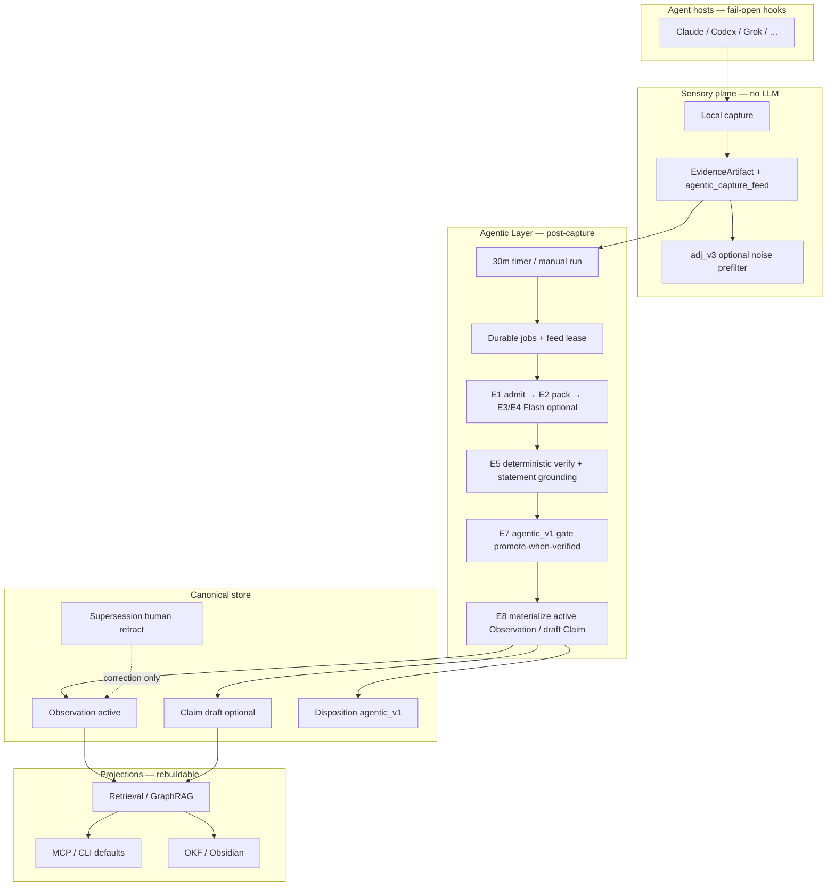
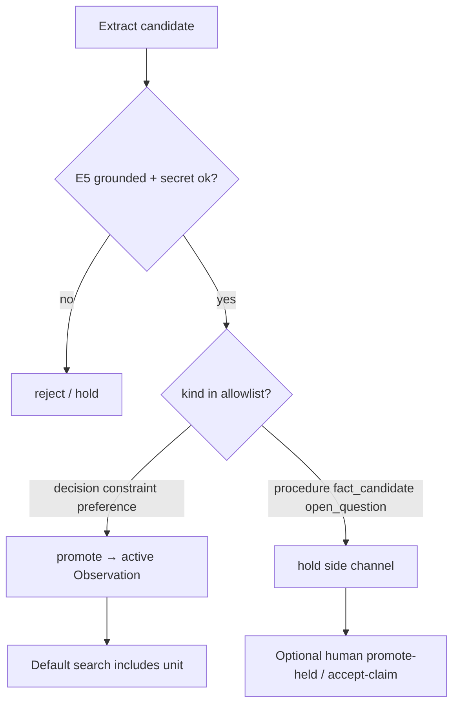

# Agentic Layer architecture (Product 6)

Status: **shipped** through `@innocarpe/carpeos@6.6.0` (ADR 0017 machinery +
**ADR 0018 HITL-free promote-when-verified** defaults).

| Slice | npm | Notes |
| --- | --- | --- |
| P0–P2 hold-first brain | 6.0.0 | Feed, runner, E1–E5, hold materialize |
| P3–P6 | 6.1–6.4 | Precision, links, draft Claims, GraphRAG ranking |
| E10 + human correction + backfill | 6.5.0 | Reconcile, promote-held, accept-claim, feed backfill |
| **HITL-free compound loop** | **6.6.0** | Promote-when-verified, retract, day spend, feed lease, 30m timer |

## Why this layer exists

CarpeOS unifies **capture** into a local event store. Without a **write-time
brain**, the store stays sensory (Evidence flood). The Agentic Layer turns
post-capture evidence into **typed, cited, graph-linked knowledge** under a
deterministic gate.

**Product contract (ADR 0018):** after agent sessions, **without any human
review step**, CarpeOS has more **default-searchable** meaning units, and the
next agent can retrieve them via MCP/CLI defaults. Humans **correct, audit, and
kill** — they are not load-bearing for value.

## Position in the system



```text
Hosts (hooks, fail-open, no LLM)
  → Local capture → EvidenceArtifact + agentic_capture_feed
  → [optional] adj_v3 prefilter
  → Agentic runner (timer every 30m or carpeos agentic run)
       E1 admit → E2 pack → E3/E4 (fake|Flash) → E5 verify (statement grounded)
       → E7 gate promote-when-verified → E8 active Observation (+ optional draft Claim)
       → E9 projection rebuild hook
  → MCP / CLI default search (promoted/active)
  → next agent session

Optional human (not required for value):
  kill switch | retract wrong unit | formal accept-claim | promote-held side channel
```

## Authority rules

| Component | May do | Must not do |
| --- | --- | --- |
| Capture | Write Evidence + enqueue feed | Call LLM; await agentic |
| `@carpeos/v5` | Redact, pack, Flash I/O, draft proposals | Own product promote defaults alone |
| Agentic gate | Promote usable meaning when E5-clean; hold side channels | Auto `AcceptanceDecision`; LLM-only Supersession |
| Materialize | Active Observation for allowlist kinds; optional draft Claim | Rewrite history |
| Human tools | Retract, promote-held, accept-claim | Be required on the happy path |
| Graph/vector | Project meaning | Create acceptance |

## Gate: promote-when-verified (ADR 0018 D3)

Default is **not** hold-first. Promote usable meaning when **all** of:

1. E5: each `quote ⊆ pack` **and** statement grounded in cited spans  
   (containment / token overlap / length factor — not quote-substring alone).
2. Secret / injection gates pass.
3. Kind ∈ **usable allowlist v1:** `decision` | `constraint` | `preference`.
4. `procedure` → hold-biased; `open_question` → side channel;  
   `fact_candidate` → **not** in v1 usable allowlist (draft Claim only if materialize).
5. Offline licensing / precision suites green under production defaults.

Escape (debug only): `--hold-first` or `CARPEOS_AGENTIC_HOLD_FIRST=1`.



## Always-on runner (S3)

| Mechanism | Role |
| --- | --- |
| Capture feed insert | Fail-open; no await LLM |
| `carpeos agentic run --once --materialize` | Bounded drain |
| **30m user timer** | `carpeos agentic timer install` (launchd / systemd user) |
| Feed lease | Mutual exclusion for concurrent runners |
| Day spend | Persistent UTC caps in agentic DB |
| Extract gate | Flash extract only after triage keep |
| Network | **Off by default**; `--allow-network` + key for live Flash |

Kill: `CARPEOS_AGENTIC=off`.

## Model policy

- **Only** `deepseek-v4-flash` for real network calls.
- Stages differ by **prompt/schema**, not model shopping.
- Fake provider for CI and network-off default.

## Job + feed model

- Sidecar agentic DB (not sync outbox).
- Job states: `pending | leased | succeeded | blocked | dead`.
- Feed states: `pending | leased | done | skipped` (lease for always-on).
- Idempotency digests per stage; once effects via canonical keys.

## Stage graph (E0–E10)

| Stage | Role |
| --- | --- |
| E0 | Capture + feed enqueue (no LLM) |
| E1 | Rule admit |
| E2 | Redact / EvidencePack |
| E3 | LLM triage (optional network) |
| E4 | LLM extract (gated on triage keep) |
| E5 | Deterministic verify + statement grounding |
| E6 | Lineage / structure markers |
| E7 | Gate `agentic_v1` |
| E8 | Materialize Observation / draft Claim |
| E9 | Project / GraphRAG rebuild hook |
| E10 | Reconcile proposals (human apply path) |

## Ontology and graph

Kinds and edges: ADR 0017 D7–D8; product visibility: ADR 0018 D4.

- **Decision dual-write:** Observation-primary (usable) + optional draft Claim.
- **Formation audit:** disposition reason codes include `formation:agentic_v1`.
- Graph remains rebuildable projection (`graph_v2`).

## Human correction surface (not happy path)

| Command | Role |
| --- | --- |
| `agentic promote-held` / `reject-held` | Side-channel holds |
| `agentic accept-claim --human-confirmed` | Optional formal stamp |
| `agentic retract --human-confirmed` | Append-only Supersession (S7) |
| `agentic list-held` / `list-claims` | Observability |
| `agentic reconcile` / `backfill` | Cleanup / history feed |

## Failure and off switches

| Switch | Effect |
| --- | --- |
| Network off | Fake stages; no provider egress |
| `CARPEOS_AGENTIC=off` | No feed work / runner |
| Day spend cap | Skip network Flash |
| `CARPEOS_AGENTIC_HOLD_FIRST=1` | Staging hold defaults |
| Timer uninstall | `carpeos agentic timer uninstall` |

## Implementation map

| Concern | Package / path |
| --- | --- |
| Jobs + orchestrator + gate | `packages/agentic` |
| Day spend / verify / runner | `packages/agentic/src/{spend,verify,runner,gate}.ts` |
| Redact/pack/LLM I/O | `packages/v5` + `packages/agentic/src/flash.ts` |
| Canonical append + retract + feed lease | `packages/local-store` |
| Graph/retrieval | `packages/retrieval` |
| CLI | `apps/carpeos-cli` `agentic *` |
| Timer | `scripts/install-agentic-timer.sh` |
| Golden / licensing fixtures | `fixtures/agentic/v1/` |

## Related

- [ADR 0017](../adr/0017-agentic-layer-write-time-knowledge.md) — write-time machinery
- [ADR 0018](../adr/0018-agentic-hitl-free-compound-loop.md) — HITL-free product contract
- [overview.md](overview.md)
- [PRD-v6](../PRD-v6.md)
- [product-6.0.0.md](../maintainers/product-6.0.0.md)
- [v6-milestones.md](../maintainers/v6-milestones.md)
