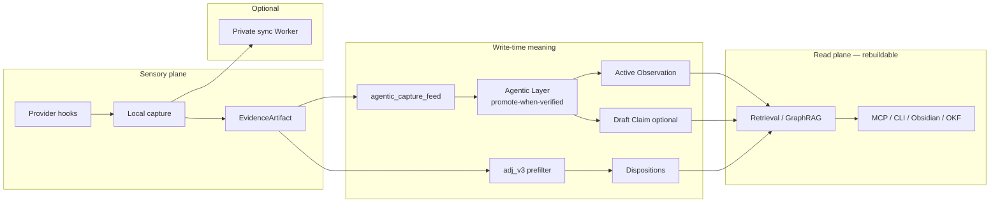

# CarpeOS Architecture Overview

Status: current-main architecture after **`@innocarpe/carpeos@6.6.0`** —
**HITL-free Agentic Layer** (ADR 0017 machinery + ADR 0018 promote-when-verified).
Local canonical store + adjudication + retrieval remain core; agentic is the
post-capture brain that compounds usable meaning **without required human
review**. Product 4 trust/evidence and Product 5 draft cortex remain as shipped.
Hosted deployment is still not claimed.

CarpeOS keeps private knowledge in a local canonical store and derives
rebuildable, non-authoritative read models from it. The canonical boundary is not
a graph, vector index, MCP response, export, or provider payload.

## Current-main boundary

| Surface | Current-main status | Authority |
| --- | --- | --- |
| Local canonical event store | Implemented and tested locally | Source of truth |
| Disposition and review history | Implemented and tested local append-only history | Source evidence, not a claim mutation |
| Retrieval and context-pack projections | Implemented and tested locally; promoted/active-only defaults apply | Rebuildable projection |
| Deterministic local vector and graph projections | Implemented and tested locally | Candidate and lineage projection |
| Provider-neutral local hook capture and fail-open hook behavior | Implemented and tested for the documented adapters | Captured evidence only |
| Hosted graph/vector, hosted or production sync, online learning, adaptive ranking, and unimplemented provider or MCP surfaces | Planned or deferred | Not deployed |
| Product 3.2 B0 reconciliation preview | **Shipped** in 3.2 / retained in 4.0 package | Metadata-only, zero-write preview |
| Product 3.2 B1 apply, writer, receipt, Supersession construction, and sync convergence | Deferred | Not part of 3.2 or 4.0 package claim |
| Product 4 trust/evidence plane (P4_0, evaluator, raw producer, publisher schemas, observed sandbox) | **Shipped** on npm `@innocarpe/carpeos@4.0.0` | Fail-closed without independent live authority; synthetic fixtures are not live authority |
| Product 4 live trust-plane workflows | In tree; **workflow_dispatch-only** until ownership activation | Not every-PR; not self-granted authority |
| Product 5 draft lane (`carpeos v5`) | **Shipped on npm** through `@innocarpe/carpeos@5.x` | `canonical_effect: "none"`; not capture hot path; M8 authority seam deferred |
| Product 6 Agentic Layer (`@carpeos/agentic`) | **HITL-free shipped** on npm `@innocarpe/carpeos@6.6.0` | Post-capture feed + Flash-only multi-stage + **promote-when-verified** usable Observations; retract + day spend + 30m timer; no capture LLM; no auto AcceptanceDecision |

Source evidence: [local store](../../packages/local-store/src/store.ts),
[retrieval](../../packages/retrieval/src/query.ts),
[graph projection](../../packages/retrieval/src/graph-projection.ts),
[local embedding provider](../../packages/retrieval/src/embedding-provider.ts),
[MCP tools](../../apps/carpeos-mcp-server/src/tools.ts), and their synthetic
tests under the corresponding `test/` directories.

## System shape



```text
provider hook
  -> provider-neutral local capture adapter
  -> protected value + metadata-only EvidenceArtifact
  -> agentic_capture_feed (fail-open; no LLM in capture)
  -> agentic runner (30m timer or manual) OR adj_v3 path
  -> append-only canonical events + dispositions
  -> policy-checked query-time derivation
  -> rebuildable local retrieval, graph, vector, MCP, and export projections
```

The implemented and tested paths in this repository are local. A provider adapter
normalizes input but does not make provider output authoritative. Hooks may fail
open so capture cannot interrupt host work. Local sync transfer/import and local
projections are implementation evidence, not hosted or production deployment.

## Canonical and derived layers

The schema-v1 canonical event types are `EvidenceArtifact`, `Observation`,
`Claim`, `AcceptanceDecision`, and `Supersession`. Events are append-only;
Claims are immutable; acceptance and supersession are represented by their own
events. Protected plaintext is outside canonical events. Trust zones are
physical isolation boundaries, and replay is idempotent within a zone.

Derived outputs may be deleted or rebuilt without changing canonical knowledge.
Retrieval rechecks candidates against visible canonical records and exposes
promoted/active knowledge by default. Graph and vector results never establish
acceptance on their own. See [projections](projections.md) and
[provider-neutral capture](provider-neutral-capture.md).

## Product 3.2 boundary

[ADR 0015](../adr/0015-policy-version-reconciliation.md) selects only B0:
a deterministic, bounded, metadata-only reconciliation preview that writes
nothing. It retains schema v1, trust zones, append-only history, fail-open
hooks, and promoted-active-only defaults. Automatic Claim or
AcceptanceDecision creation remains off. B0 shipped in `@innocarpe/carpeos@3.2.0`
and remains the correction-preview contract under 4.0. B1 apply remains deferred.

## Product 4.0 boundary

Product 4 adds a **base-owned evidence and release-gate plane** around the same
canonical loop. Candidate execution stays unprivileged; evaluators recompute
attestations; publishers bind C/artifact/run identity; release-authority
freshness fails closed without independent live evidence. Live App/settings
ownership and human approval are **out of band** — the package may publish
while the gate reports procedural **defer**. See
[product-4.0.0.md](../maintainers/product-4.0.0.md) and [PRD-v4](../PRD-v4.md).

This document does not claim hosted deployment or self-granted release authority.

## Product 5.0 boundary

Product 5 is an **opt-in draft lane** (`carpeos v5`) for offline redaction, EvidencePack,
proposal reduce, and DeepSeek Direct–primary extract. Every V5 record keeps
`canonical_effect: "none"`. Capture hooks never call the draft pipeline. See
[product-5.0.0.md](../maintainers/product-5.0.0.md) and [PRD-v5](../PRD-v5.md).

## Product 6.0 boundary (HITL-free compound loop)

Product 6 is a post-capture **Agentic Layer** that forms grounded, typed,
graph-linked knowledge under `agentic_v1` without putting LLM on the capture hot
path. Real model id is frozen to **`deepseek-v4-flash` only**.

From **6.6.0** (ADR 0018), the product default is **promote-when-verified**:
E5 statement grounding + allowlisted kinds become **active Observations** in
default search **without** human promote. Humans retract mistakes, stamp formal
acceptance, or clear side-channel holds — they are not required for compound
value. A **30-minute** user timer keeps the brain breathing. See
[agentic-layer.md](agentic-layer.md),
[ADR 0017](../adr/0017-agentic-layer-write-time-knowledge.md),
[ADR 0018](../adr/0018-agentic-hitl-free-compound-loop.md),
[PRD-v6](../PRD-v6.md), and [product-6.0.0.md](../maintainers/product-6.0.0.md).

```text
provider hook
  -> local capture (Evidence only; fail-open)
  -> agentic_capture_feed (+ optional adj_v3 noise prefilter)
  -> agentic jobs (Flash multi-stage when network on; fake offline)
  -> E5 statement-grounded verify
  -> agentic_v1 gate (promote-when-verified default)
  -> active Observation / optional draft Claim + provenance
  -> rebuildable retrieval + graph projections
  -> human retract / accept-claim only as correction
```

## Synthetic example

A synthetic provider hook can create protected evidence metadata in a local
trust zone. Later, an explicitly authorized review may append a disposition or
AcceptanceDecision. Retrieval, graph/vector candidates, context packs, and
exports may then reflect visible promoted/active records, while preserving
lineage and redaction metadata. None of those projections changes canonical
authority.
